## 1

Установить на VM Apache веб-сервер и настроить его на работу с PHP (например, как указано в инструкции. Поменять порт по умолчанию на 8080. Убедиться, что Apache работает и возвращает страницу с информацией о PHP.

```
# apt update

# apt install apache2

# cat /etc/apache2/sites-available/000-default.conf | grep 8080
<VirtualHost *:8080>

# cat /etc/apache2/ports.conf | grep 8080
Listen 8080

# apt install php libapache2-mod-php

# cat /var/www/html/phpinfo.php
<?php
  phpinfo();
?>
```
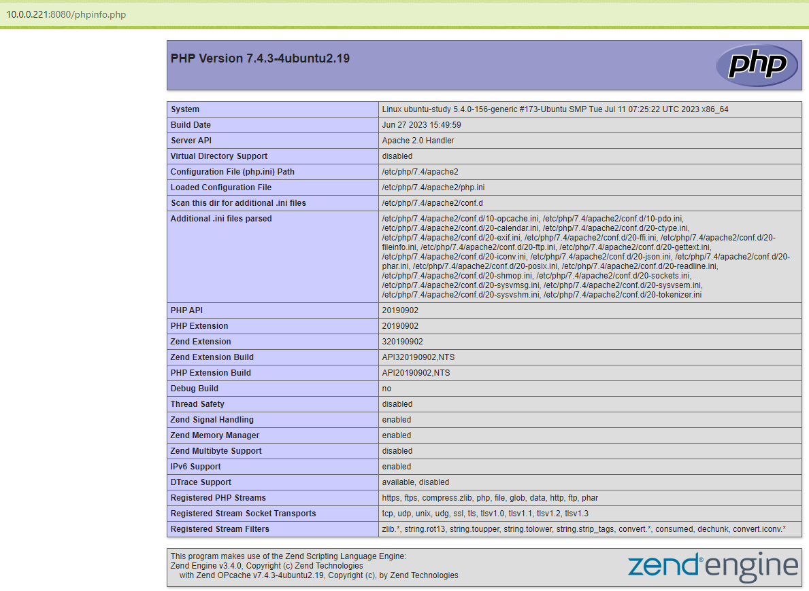


## 2

Установить на VM Nginx.

```
# apt install nginx

# cat /etc/nginx/sites-available/default | grep 8081
        listen 8081 default_server;
        listen [::]:8081 default_server;
```
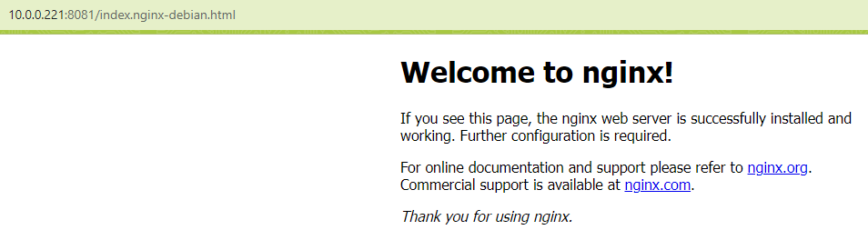


## 3

Скопировать на VM папку https://github.com/tms-dos17-onl/_sandbox/tree/main/lecture15/react_nginx/build и настроить Nginx на хостинг этого веб-приложения. Проверить работоспособность приложения путем посещения всех доступных ссылок на главной странице и обновления каждой из страниц в веб-браузере.

```
# ls -la /var/www/hw12/html/
total 56
drwxr-xr-x 3 root root 4096 Aug 25 16:39 .
drwxr-xr-x 4 root root 4096 Aug 25 16:38 ..
-rw-r--r-- 1 root root  497 Aug 25 07:03 50x.html
-rw-r--r-- 1 root root  366 Aug 25 07:03 asset-manifest.json
-rw-r--r-- 1 root root 3870 Aug 25 07:03 favicon.ico
-rw-r--r-- 1 root root  584 Aug 25 07:03 index.html
-rw-r--r-- 1 root root 5347 Aug 25 07:03 logo192.png
-rw-r--r-- 1 root root 9664 Aug 25 07:03 logo512.png
-rw-r--r-- 1 root root  492 Aug 25 07:03 manifest.json
-rw-r--r-- 1 root root   67 Aug 25 07:03 robots.txt
drwxr-xr-x 3 root root 4096 Aug 25 07:03 static

# cat /etc/nginx/sites-available/hw12
server {
        listen 8081;
        listen [::]:8081;

        root /var/www/hw12/html;

        index index.html index.htm index.nginx-debian.html;

        server_name hw12;

        location / {
                try_files $uri $uri/ =404;
        }

}

# ln -s /etc/nginx/sites-available/hw12 /etc/nginx/sites-enabled/
```
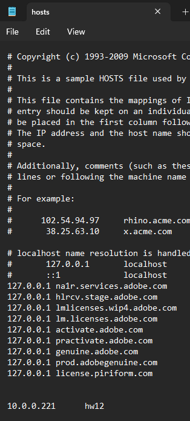
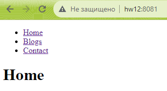

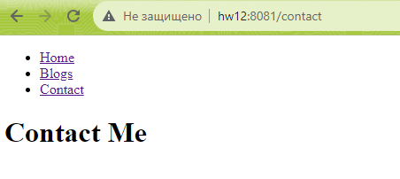


## 4

Скопировать на VM папку https://github.com/tms-dos17-onl/_sandbox/tree/main/lecture15/api и запустить Python REST Api приложение согласно инструкции. Проверить работоспособность всех доступных REST Api методов с помощью Swagger.

```
# cd /lecture15/api

# apt install python3-pip

# pip install -r requirements.txt

# python3 main.py
 * Serving Flask app 'main'
 * Debug mode: on
WARNING: This is a development server. Do not use it in a production deployment. Use a production WSGI server instead.
 * Running on all addresses (0.0.0.0)
 * Running on http://127.0.0.1:5000
 * Running on http://10.0.0.221:5000
Press CTRL+C to quit
 * Restarting with stat
 * Debugger is active!
 * Debugger PIN: 852-963-269


10.0.0.21 - - [25/Aug/2023 17:20:27] "GET /apispec_1.json HTTP/1.1" 200 -
10.0.0.21 - - [25/Aug/2023 17:21:41] "GET /delayedResponse HTTP/1.1" 200 -
10.0.0.21 - - [25/Aug/2023 17:22:35] "GET /ping HTTP/1.1" 200 -
10.0.0.221 - - [25/Aug/2023 17:23:09] "GET /bigResponse HTTP/1.1" 200 -
10.0.0.21 - - [25/Aug/2023 17:24:13] "POST /readBigResponseSlowly HTTP/1.1" 200 -
10.0.0.21 - - [25/Aug/2023 17:25:04] "POST /uploadFile HTTP/1.1" 200 -
10.0.0.21 - - [25/Aug/2023 17:25:13] "POST /uploadFile HTTP/1.1" 200 -
10.0.0.21 - - [25/Aug/2023 17:26:00] "POST /uploadFile HTTP/1.1" 200 -

```
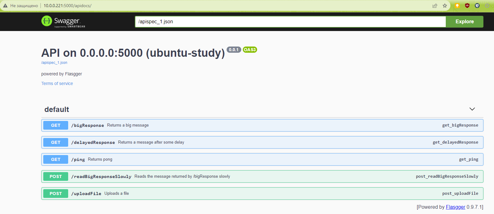
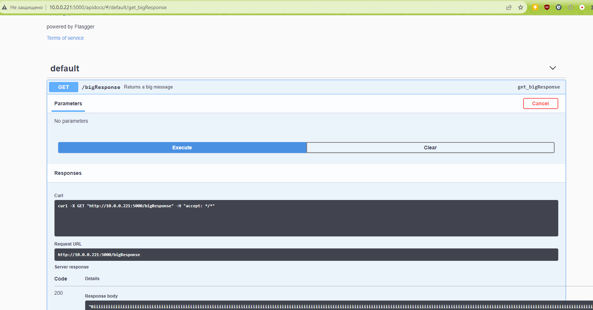
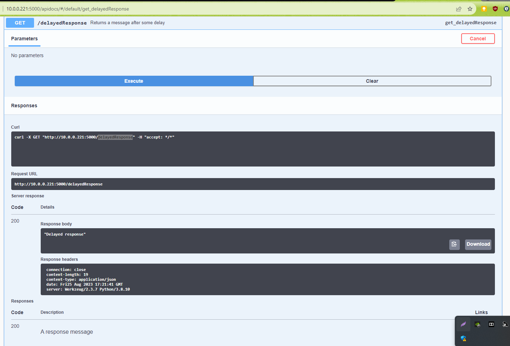
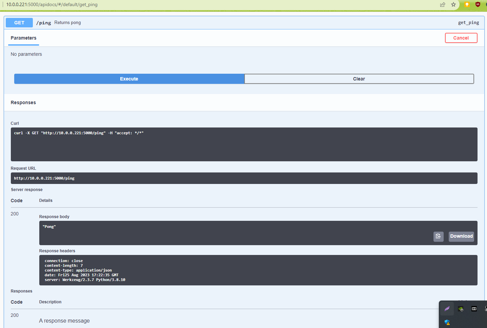
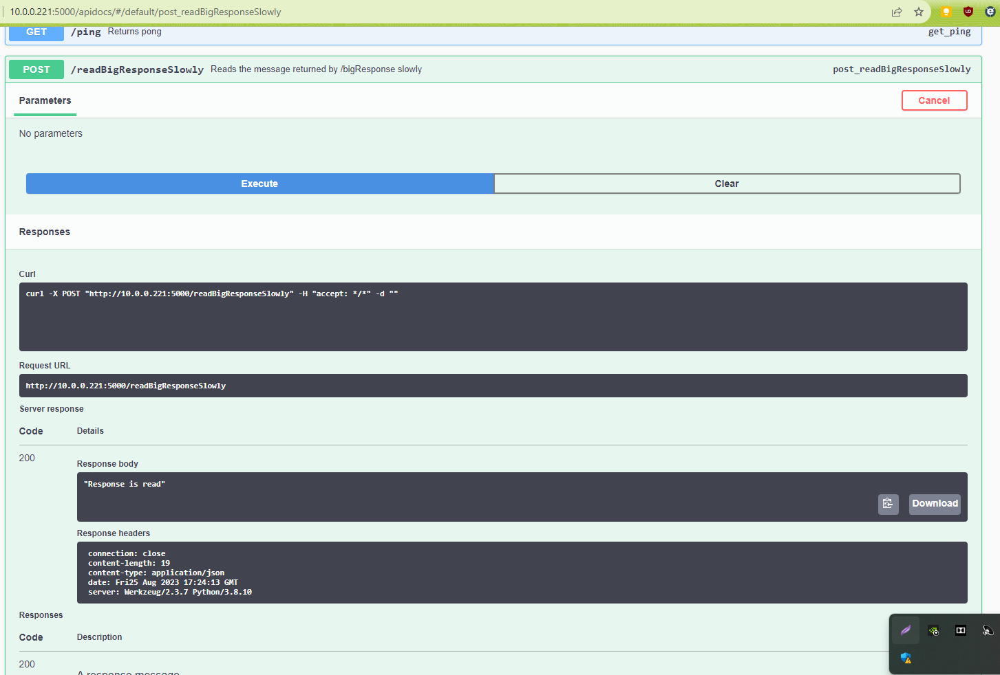
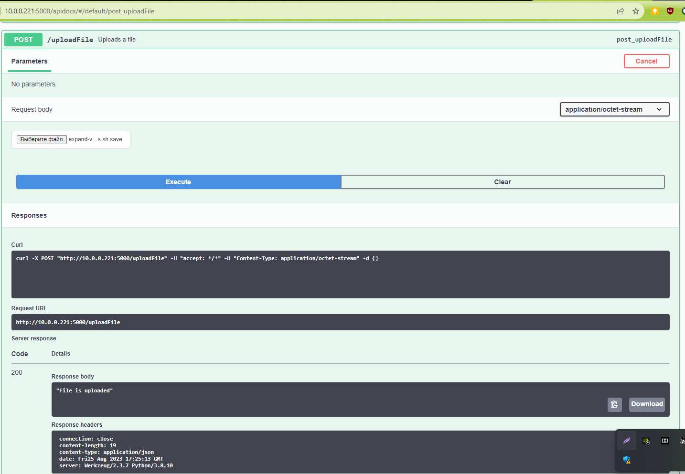


## 5

Настроить Nginx как Reverse Proxy для Python REST Api приложения из предыдущего пункта. А затем:
- Открыть Swagger для веб-приложения через Nginx (http://<NGINX_IP>:<NGINX_PORT>/apidocs).
- Проверить работоспособность всех доступных REST Api методов через Nginx с помощью Swagger. При необходимости поправить конфигурацию Nginx сервера, чтобы все методы работали.
- Для тестирования метода /uploadBigFile использовать файл размером больше 1MB.
- Вывести в консоль содержимое файла конфигурации Nginx с измененными значениями и комментариями.

```
# cat /etc/nginx/sites-available/hw12
server {
        listen 8081;
        listen [::]:8081;

        root /home/notme/api/;

        index index.html index.htm index.nginx-debian.html;

        server_name hw12;

        location / {
                proxy_pass          http://127.0.0.1:5000/;
                rewrite /(.*) /$1 break;
                client_max_body_size 100M;
                proxy_read_timeout 90s;
                proxy_set_header    Host $host;
                proxy_set_header    X-Real-IP $remote_addr;
                proxy_set_header    X-Forwarded-For $proxy_add_x_forwarded_for;
                proxy_set_header    X-Forwarded-Proto $scheme;
                location /apidocs {
                        rewrite /(.*) /$1 break;
                        proxy_pass          http://127.0.0.1:5000/apidocs;
                }
        }

}

# cat /etc/hosts | grep hw12
127.0.0.1 hw12
```
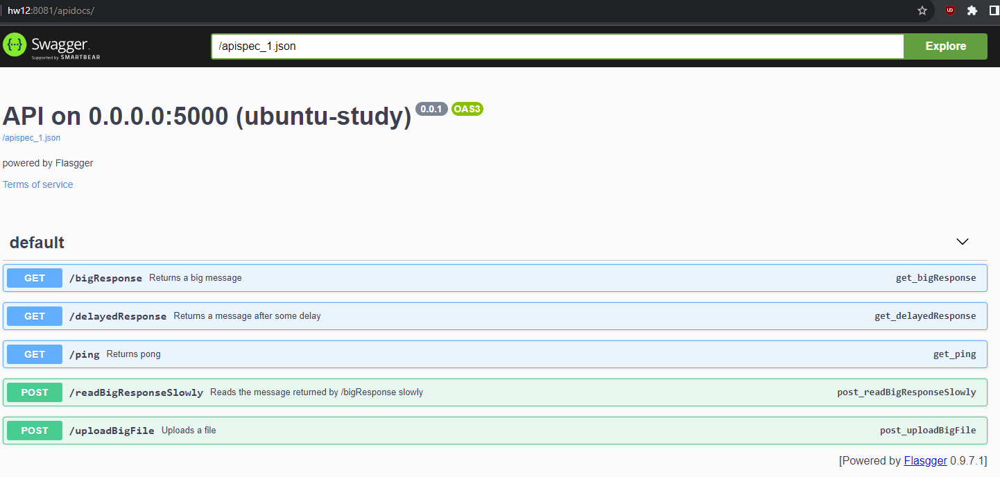
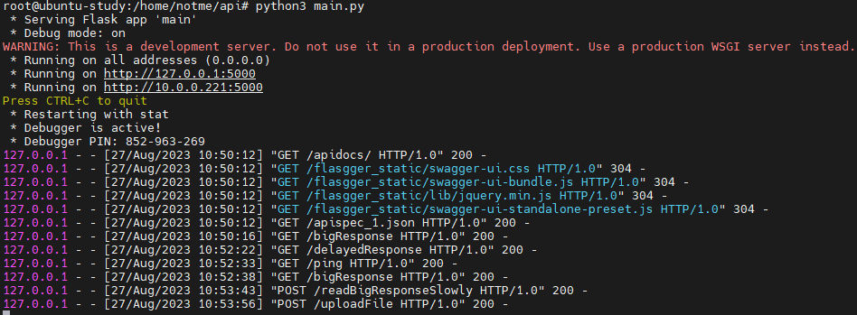
