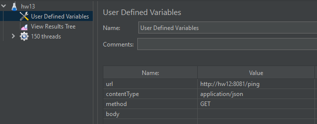
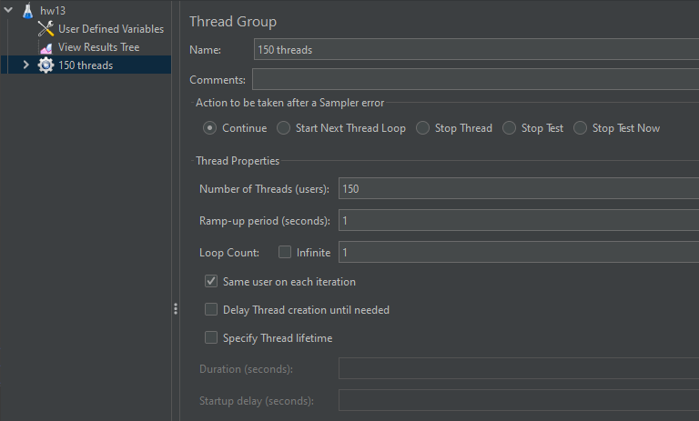

## 1

Скопировать на VM папку https://github.com/tms-dos17-onl/_sandbox/tree/main/lecture15/api и запустить Python REST Api приложение согласно инструкции. Проверить работоспособность всех доступных REST Api методов с помощью Swagger.

```
см. п.4 hw12
```


## 2

Установить на VM Nginx и настроить его как Reverse Proxy для Python REST Api приложения из предыдущего пункта

```
см. п.5 hw12
```


## 3

Установить JMeter и написать тестовый сценарий для проверки производительности приложения путем выполнения HTTP GET запроса http://<NGINX_IP>:<NGINX_PORT>/ping от 100 пользователей.

```
последние запроса:
Latency:14055
Latency:14047
```




## 4

Запустить ещё один экземпляр Python REST Api приложения на другом порту.

```
$ python3 main.py
 * Serving Flask app 'main'
 * Debug mode: on
WARNING: This is a development server. Do not use it in a production deployment. Use a production WSGI server instead.
 * Running on all addresses (0.0.0.0)
 * Running on http://127.0.0.1:5001
 * Running on http://10.0.0.221:5001
```


## 5

Изменить конфигурацию Nginx, чтобы он использовал в качестве бэкенда 2 приложения.

```
$cat /etc/nginx/sites-available/hw12

upstream apidocs{
                server 127.0.0.1:5000;
                server 127.0.0.1:5001;
}

server {
        listen 8081;
        listen [::]:8081;

        root /home/notme/api;

        index index.html index.htm index.nginx-debian.html;

        server_name hw12;

        location / {
                proxy_pass          http://apidocs;
                rewrite /(.*) /$1 break;
                proxy_set_header    Host $host;
                proxy_set_header    X-Real-IP $remote_addr;
                proxy_set_header    X-Forwarded-For $proxy_add_x_forwarded_for;
                proxy_set_header    X-Forwarded-Proto $scheme;
                location /apidocs {
                        rewrite /(.*) /$1 break;
                        proxy_pass          http://127.0.0.1:5000/apidocs;
                        }
        }

}
```


## 6

Повторить JMeter сценарий и сравнить результаты.

```
последние 2 запроса:
Latency:7062
Latency:7093

запросы распределялись поочерёдно между первым и вторым приложением
```