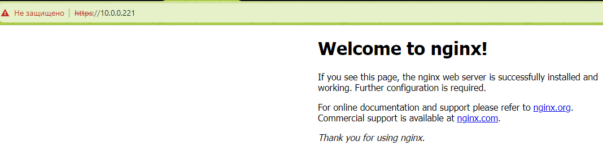
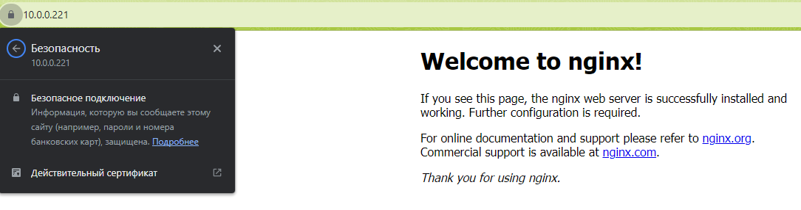
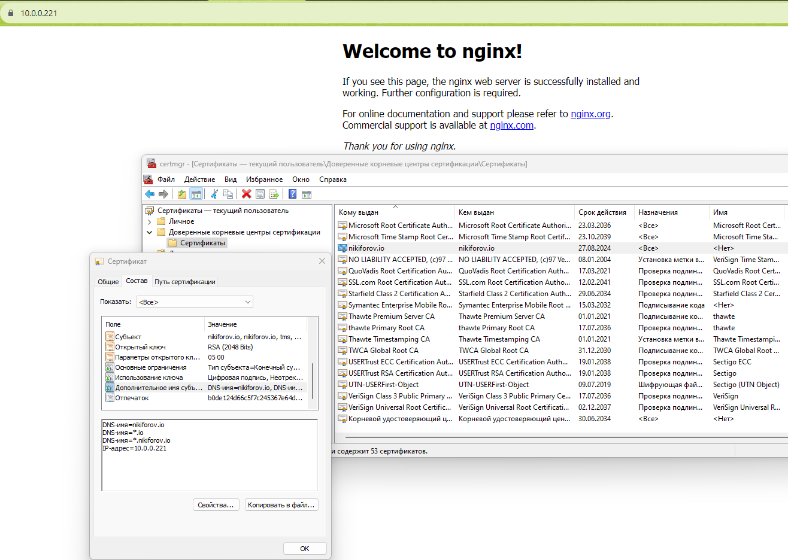
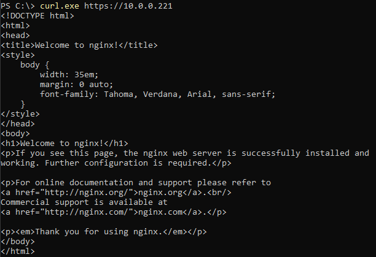

## 1

Сгенерировать пару ключей/сертификатов (private.pem и public.pem) при помощи OpenSSL.

```
# openssl genrsa -out private.pem 2048 && openssl rsa -in private.pem -out public.pem -outform PEM -pubout
```


## 2

Создать скрипт encrypt.sh, который считывает стандартный поток ввода, шифрует его при помощи public.pem через OpenSSL и выводит в стандартный поток вывода.

```
#!/bin/bash

read -r "Enter a phrase: " phrase

echo "${phrase}" > encrypt.txt

openssl rsautl -encrypt -inkey public.pem -pubin -in encrypt.txt -out encrypt.dat
```


## 3

Создать скрипт decrypt.sh, который считывает стандартный поток ввода, расшифровывает его при помощи private.pem через OpenSSL и выводит в стандартный поток вывода.

```
#!/bin/bash

openssl rsautl -decrypt -inkey private.pem -in encrypt.dat -out new_encrypt.txt

cat new_encrypt.txt
```

## 4

Сгенерировать публичный сертификат public-nginx.pem для private.pem через OpenSSL, используя <LASTNAME>.io в качестве Common Name (CN).

```
# cat /etc/ssl/multi-domain.openssl.cnf

............
[ req ]
............
req_extensions = v3_req
............
[ v3_req ]
............
subjectAltName = @alt_names
............
[ alt_names ]
DNS.0 = nikiforov.io
DNS.1 = *.io
DNS.2 = *.nikiforov.io
IP.0  = 10.0.0.221


# openssl req -x509 -new -key private.pem -out public-nginx.pem -days 365 -nodes -extensions v3_req -config /etc/ssl/multi-domain.openssl.cnf

You are about to be asked to enter information that will be incorporated
into your certificate request.
What you are about to enter is what is called a Distinguished Name or a DN.
There are quite a few fields but you can leave some blank
For some fields there will be a default value,
If you enter '.', the field will be left blank.
-----
Country Name (2 letter code) [AU]:by
State or Province Name (full name) [Some-State]:mogilev
Locality Name (eg, city) []:mogilev
Organization Name (eg, company) [Internet Widgits Pty Ltd]:tms
Organizational Unit Name (eg, section) []:nikiforov.io
Common Name (e.g. server FQDN or YOUR name) []:nikiforov.io
Email Address []:
```


## 5

Настроить Nginx на работу по HTTPS, используя сертификаты из предыдущего задания. Например, чтобы Nginx возвращал домашнюю страницу по HTTPS.

```
cp private.pem /etc/nginx/private.pem
cp public-nginx.pem /etc/nginx/public-nginx.pem

# cat /etc/nginx/sites-available/default
server {
        listen 443 ssl default_server;
        listen [::]:443 ssl default_server;

        ssl_certificate     public-nginx.pem;
        ssl_certificate_key private.pem;

        root /var/www/html;

        index index.nginx-debian.html;

        server_name _;

        location / {
                try_files $uri $uri/ =404;
        }
}

```



## 6

Настроить доверие публичному сертификату в браузере и проверить это.

```
```




## 7

А теперь открыть домашнюю страницу Nginx по HTTPS через curl не прибегая к опции -k

```
```
