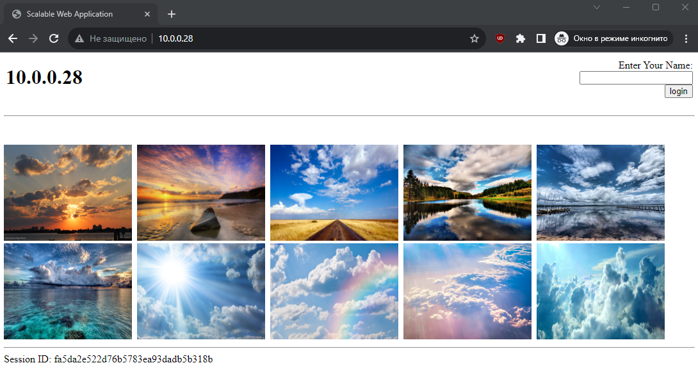

## 1

Реализовать Ansible playbook, который:
Устанавливает LAMP стэк на VM при помощи ролей:
- Apache
- MySQL
- PHP

```
$ ansible-galaxy install geerlingguy.apache geerlingguy.mysql geerlingguy.php
$ ansible-galaxy list
# /home/notme/.ansible/roles
- geerlingguy.php, 5.0.1
- geerlingguy.mysql, 4.3.3
- geerlingguy.apache, 3.3.0
```


## 2

Устанавливает memcached сервис на VM при помощи роли

```
$ ansible-galaxy install geerlingguy.memcached
$ ansible-galaxy list | grep memcached
- geerlingguy.memcached, 2.2.0
```


## 3

Перенести логику по установке приложения https://github.com/qyjohn/simple-lamp в Ansible роль.

```
$ ssh-copy-id notme@10.0.0.28
/usr/bin/ssh-copy-id: INFO: Source of key(s) to be installed: "/home/notme/.ssh/id_rsa.pub"
/usr/bin/ssh-copy-id: INFO: attempting to log in with the new key(s), to filter out any that are already installed
/usr/bin/ssh-copy-id: INFO: 1 key(s) remain to be installed -- if you are prompted now it is to install the new keys
notme@10.0.0.28's password:

Number of key(s) added: 1

Now try logging into the machine, with:   "ssh 'notme@10.0.0.28'"
and check to make sure that only the key(s) you wanted were added.

notme@ubuntu-study:~/hw17$ ansible-playbook all_roles.yml -i servers -K
BECOME password:

PLAY [Roles Configuration] *******
............
RUNNING HANDLER [geerlingguy.memcached : restart memcached] **************************************************************************************************************************************************
changed: [lamp]

PLAY RECAP ***************************************************************************************************************************************************************************************************
lamp                       : ok=103  changed=36   unreachable=0    failed=0    skipped=31   rescued=0    ignored=0
```


## 4

Создать Pull Request (PR) содержащий Ansible playbook и разработанную роль/роли.

```
```