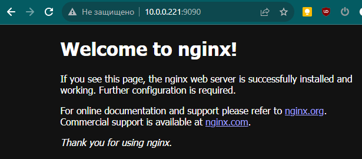
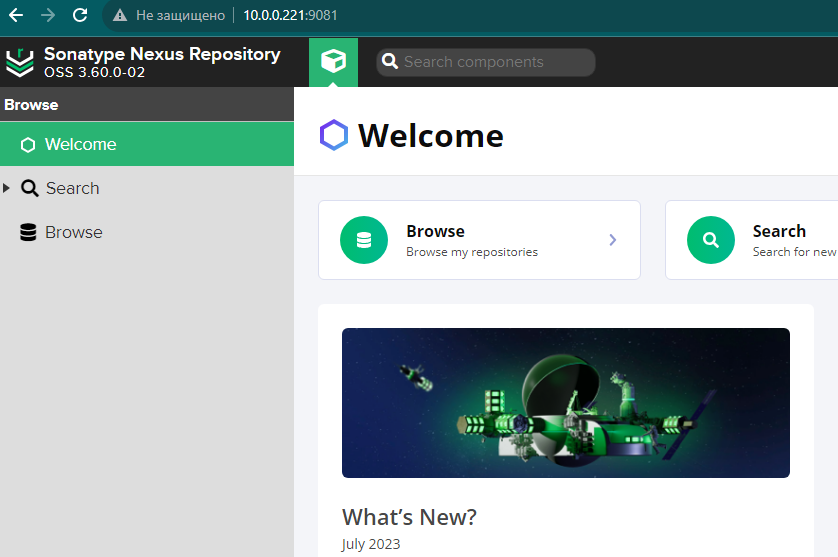
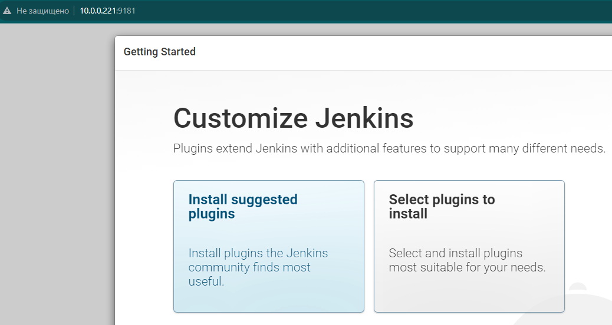

## 1

Установить Docker на хостовую ОС. В случае с Windows использовать WSL backend.

```
$ sudo install -m 0755 -d /etc/apt/keyrings
$ curl -fsSL https://download.docker.com/linux/ubuntu/gpg | sudo gpg --dearmor -o /etc/apt/keyrings/docker.gpg
$ sudo chmod a+r /etc/apt/keyrings/docker.gpg
$ echo \
  "deb [arch="$(dpkg --print-architecture)" signed-by=/etc/apt/keyrings/docker.gpg] https://download.docker.com/linux/ubuntu \
  "$(. /etc/os-release && echo "$VERSION_CODENAME")" stable" | \
  sudo tee /etc/apt/sources.list.d/docker.list > /dev/null
$ sudo apt-get update
$ sudo apt-get install docker-ce docker-ce-cli containerd.io docker-buildx-plugin docker-compose-plugin
```


## 2

Убедиться, что Docker работает исправно путем запуска контейнера hello-world.

```
$ sudo docker run hello-world

Unable to find image 'hello-world:latest' locally
latest: Pulling from library/hello-world
719385e32844: Pull complete
Digest: sha256:4f53e2564790c8e7856ec08e384732aa38dc43c52f02952483e3f003afbf23db
Status: Downloaded newer image for hello-world:latest

Hello from Docker!
```


## 3

Установить Nginx используя Docker образ

```
$ sudo docker run --name nginx -d -p 9090:80 nginx
Unable to find image 'nginx:latest' locally
latest: Pulling from library/nginx
........
Status: Downloaded newer image for nginx:latest
5115b080d846ac6c9b2de18d71d7229a36e5d29069982c1879955bf8093e942e
```



## 4

Изучить следующие команды и их флаги:
- docker run (-i, -t, -d, --rm)
- docker ps (-a, -l, -q)
- docker images
- docker start/docker stop/docker restart
- docker exec

```
```


## 5

Установить Nexus используя Docker образ

```
$ sudo docker run -d -p 9081:8081 --name nexus sonatype/nexus3
Unable to find image 'sonatype/nexus3:latest' locally
latest: Pulling from sonatype/nexus3
........
Status: Downloaded newer image for sonatype/nexus3:latest
4a307fb3603854d66361902e9534aaed2fa44f6a390b4f5f8930d25194ce922a
```



## 6

Установить Jenkins используя Docker образ

```
$ sudo docker run -p 9181:8080 -p 50000:50000 -v /home/notme/jenkins_home/:/var/jenkins_home jenkins:2.60.3
Unable to find image 'jenkins:2.60.3' locally
2.60.3: Pulling from library/jenkins
........
Digest: sha256:eeb4850eb65f2d92500e421b430ed1ec58a7ac909e91f518926e02473904f668
Status: Downloaded newer image for jenkins:2.60.3
Running from: /usr/share/jenkins/jenkins.war
```
