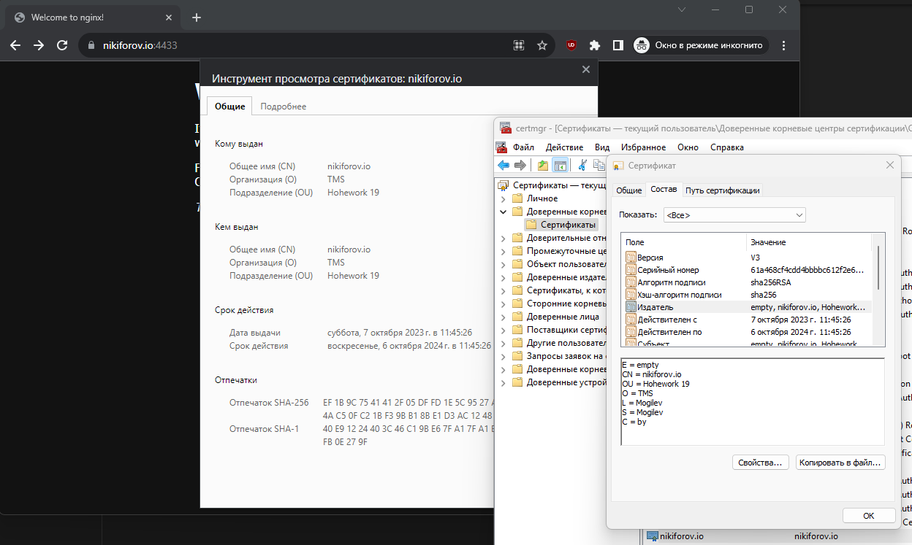

## 1

Установить Nginx и смонтировать в него:
- конфигурационный файл с хоста, который выполняет настройку HTTPS для страницы по умолчанию
- директорию с сертификатами

```
# cat /etc/nginx/sites-available/default
server {
        listen 443 ssl default_server;
        listen [::]:443 ssl default_server;

        ssl_certificate     /etc/nginx/certs/public-nginx.pem;
        ssl_certificate_key /etc/nginx/certs/private.pem;

#        root /var/www/html;
        root /usr/share/nginx/html;

        index index.html index.htm index.nginx-debian.html;

        server_name _;

        location / {
                try_files $uri $uri/ =404;
        }
}

# docker run --rm -p 4433:443 -v /etc/nginx/certs/:/etc/nginx/certs/:ro -v /etc/nginx/sites-available/default:/etc/nginx/conf.d/default.conf:ro nginx
/docker-entrypoint.sh: /docker-entrypoint.d/ is not empty, will attempt to perform configuration
/docker-entrypoint.sh: Looking for shell scripts in /docker-entrypoint.d/
/docker-entrypoint.sh: Launching /docker-entrypoint.d/10-listen-on-ipv6-by-default.sh
10-listen-on-ipv6-by-default.sh: info: can not modify /etc/nginx/conf.d/default.conf (read-only file system?)
/docker-entrypoint.sh: Sourcing /docker-entrypoint.d/15-local-resolvers.envsh
/docker-entrypoint.sh: Launching /docker-entrypoint.d/20-envsubst-on-templates.sh
/docker-entrypoint.sh: Launching /docker-entrypoint.d/30-tune-worker-processes.sh
/docker-entrypoint.sh: Configuration complete; ready for start up
2023/10/07 09:18:42 [notice] 1#1: using the "epoll" event method
2023/10/07 09:18:42 [notice] 1#1: nginx/1.25.2
2023/10/07 09:18:42 [notice] 1#1: built by gcc 12.2.0 (Debian 12.2.0-14)
2023/10/07 09:18:42 [notice] 1#1: OS: Linux 5.4.0-162-generic
2023/10/07 09:18:42 [notice] 1#1: getrlimit(RLIMIT_NOFILE): 1048576:1048576
2023/10/07 09:18:42 [notice] 1#1: start worker processes
2023/10/07 09:18:42 [notice] 1#1: start worker process 21
2023/10/07 09:18:42 [notice] 1#1: start worker process 22
10.0.0.21 - - [07/Oct/2023:09:19:05 +0000] "GET / HTTP/1.1" 200 615 "-" "Mozilla/5.0 (Windows NT 10.0; Win64; x64) AppleWebKit/537.36 (KHTML, like Gecko) Chrome/117.0.0.0 Safari/537.36" "-"
```



## 2

Запустить 2 Docker контейнера (например, Docker Getting Started и netshoot) с настройками сети по умолчанию и проверить есть ли между ними соединение.

```
# docker run --rm -d -p 88:80 docker/getting-started
# docker run -it --net host nicolaka/netshoot
                    dP            dP                           dP
                    88            88                           88
88d888b. .d8888b. d8888P .d8888b. 88d888b. .d8888b. .d8888b. d8888P
88'  `88 88ooood8   88   Y8ooooo. 88'  `88 88'  `88 88'  `88   88
88    88 88.  ...   88         88 88    88 88.  .88 88.  .88   88
dP    dP `88888P'   dP   `88888P' dP    dP `88888P' `88888P'   dP

Welcome to Netshoot! (github.com/nicolaka/netshoot)
Version: 0.11

ubuntu  ~  ping 172.17.0.2
PING 172.17.0.2 (172.17.0.2) 56(84) bytes of data.
64 bytes from 172.17.0.2: icmp_seq=1 ttl=64 time=0.103 ms
64 bytes from 172.17.0.2: icmp_seq=2 ttl=64 time=0.038 ms
--- 172.17.0.2 ping statistics ---
2 packets transmitted, 2 received, 0% packet loss, time 1021ms
rtt min/avg/max/mdev = 0.038/0.070/0.103/0.032 ms

# docker exec -it e68e26353629 /bin/sh
/ # ping 10.0.0.28
PING 10.0.0.28 (10.0.0.28): 56 data bytes
64 bytes from 10.0.0.28: seq=0 ttl=64 time=0.117 ms
64 bytes from 10.0.0.28: seq=1 ttl=64 time=0.056 ms
--- 10.0.0.28 ping statistics ---
2 packets transmitted, 2 packets received, 0% packet loss
round-trip min/avg/max = 0.056/0.086/0.117 ms

# docker ps --format '{{ .ID }} {{ .Names }} {{ json .Networks }}'
dcf240b9d65d compassionate_noyce "host"
e68e26353629 reverent_leakey "bridge"

# docker inspect e68e26353629 -f "{{json .NetworkSettings.Networks }}"
{"bridge":{"IPAMConfig":null,"Links":null,"Aliases":null,"NetworkID":"62656c7d61b23548e048286e0c8a06bab4e620e4c95fcb8b5db50cf3d09f5258","EndpointID":"2ac610b4b4d55412d17330bfb8fddfdac3289b7faf8b6fafab787f1429153d0a","Gateway":"172.17.0.1","IPAddress":"172.17.0.2","IPPrefixLen":16,"IPv6Gateway":"","GlobalIPv6Address":"","GlobalIPv6PrefixLen":0,"MacAddress":"02:42:ac:11:00:02","DriverOpts":null}}

# docker inspect dcf240b9d65d -f "{{json .NetworkSettings.Networks }}"
{"host":{"IPAMConfig":null,"Links":null,"Aliases":null,"NetworkID":"2b064be528fc1bd8ec243a322859bf4d71f4e6a2e7063602a5b0fbc89754a1b2","EndpointID":"de94029fb8c89077037ea4a7d51a76f604657df79fc8b257f48183ad8a7fcbae","Gateway":"","IPAddress":"","IPPrefixLen":0,"IPv6Gateway":"","GlobalIPv6Address":"","GlobalIPv6PrefixLen":0,"MacAddress":"","DriverOpts":null}}
```


## 3

Создать именованный Docker volume, который будет использоваться для хранения данных MariaDB. Установить MariaDB версии 11.0 используя ранее созданный volume. Затем:
- Запустить интерактивную сессию Bash в запущенном контейнере при помощи docker exec
- Проверить версию MariaDB через SQL запрос.
- Создать БД, таблицу и запись.
- Выполнить апгрейд MariaDB путем подмены версии используемого Docker образа на 11.1.2.
- Проверить, что версия MariaDB поменялась.
- Проверить, что данные остались.

```
# docker volume create mariadb
mariadb

# docker volume ls
DRIVER    VOLUME NAME
local     mariadb

# docker run --detach --name mariadb.11.0 --env MARIADB_USER=mariadb --env MARIADB_PASSWORD=mariadb --env MARIADB_ROOT_PASSWORD=mariadb -v mariadb:/var/lib/mysql  mariadb:11.0
# docker exec -it mariadb.11.0 /bin/bash
/# mariadb -u root --password=mariadb -e "SHOW VARIABLES LIKE 'version';"
+---------------+---------------------------------------+
| Variable_name | Value                                 |
+---------------+---------------------------------------+
| version       | 11.0.3-MariaDB-1:11.0.3+maria~ubu2204 |
+---------------+---------------------------------------+

/# mariadb -u root -p
Enter password:
Welcome to the MariaDB monitor.  Commands end with ; or \g.
Your MariaDB connection id is 4
Server version: 11.0.3-MariaDB-1:11.0.3+maria~ubu2204 mariadb.org binary distribution

Copyright (c) 2000, 2018, Oracle, MariaDB Corporation Ab and others.

Type 'help;' or '\h' for help. Type '\c' to clear the current input statement.

MariaDB [(none)]> create database hw19;
Query OK, 1 row affected (0.000 sec)
MariaDB [(none)]> use hw19;
Database changed
MariaDB [hw19]> create table product( product_id int auto_increment, product_name varchar(255) not null, product_cost decimal(15,2) not null, primary key (product_id));
Query OK, 0 rows affected (0.010 sec)
MariaDB [hw19]> INSERT INTO product (product_name, product_cost) VALUES ('Milk', 12.4);
Query OK, 1 row affected (0.004 sec)

MariaDB [hw19]> select * from product;
+------------+--------------+--------------+
| product_id | product_name | product_cost |
+------------+--------------+--------------+
|          1 | Milk         |        12.40 |
+------------+--------------+--------------+
1 row in set (0.000 sec)


# docker run --detach --name mariadb.11.1.2 --env MARIADB_USER=mariadb --env MARIADB_PASSWORD=mariadb --env MARIADB_ROOT_PASSWORD=mariadb -v mariadb:/var/lib/mysql  mariadb:11.1.2
# docker exec -it mariadb.11.1.2 /bin/bash
# mariadb -u root -p
Enter password:
Welcome to the MariaDB monitor.  Commands end with ; or \g.
Your MariaDB connection id is 3
Server version: 11.1.2-MariaDB-1:11.1.2+maria~ubu2204 mariadb.org binary distribution

Copyright (c) 2000, 2018, Oracle, MariaDB Corporation Ab and others.

Type 'help;' or '\h' for help. Type '\c' to clear the current input statement.

MariaDB [(none)]> show databases;
+--------------------+
| Database           |
+--------------------+
| hw19               |
| information_schema |
| mysql              |
| performance_schema |
| sys                |
+--------------------+
5 rows in set (0.001 sec)

MariaDB [(none)]> use hw19;
MariaDB [hw19]> select * from product;
+------------+--------------+--------------+
| product_id | product_name | product_cost |
+------------+--------------+--------------+
|          1 | Milk         |        12.40 |
+------------+--------------+--------------+
1 row in set (0.001 sec)
```