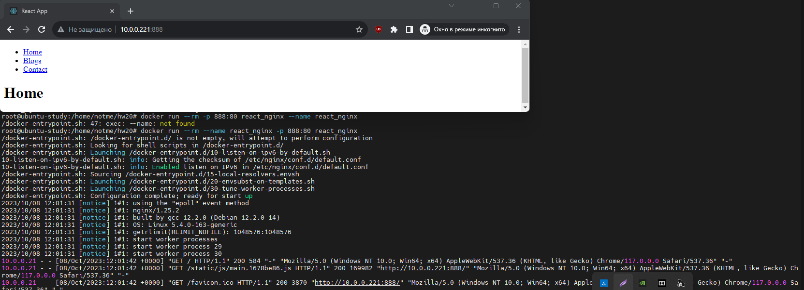
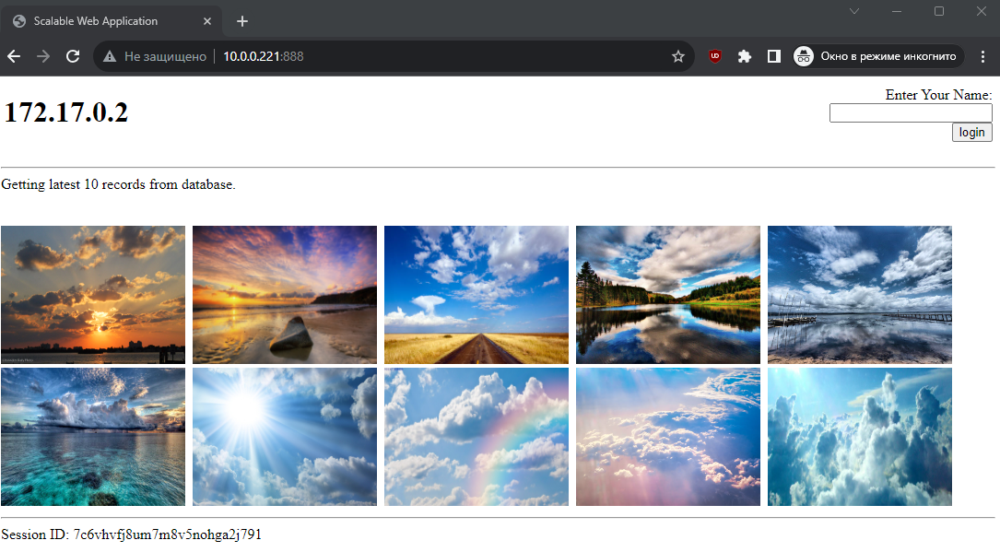
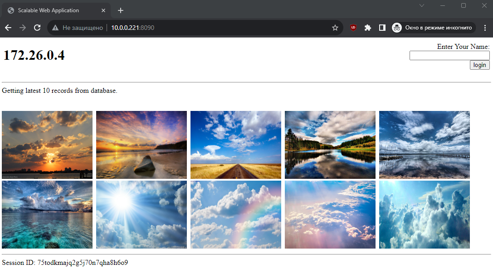
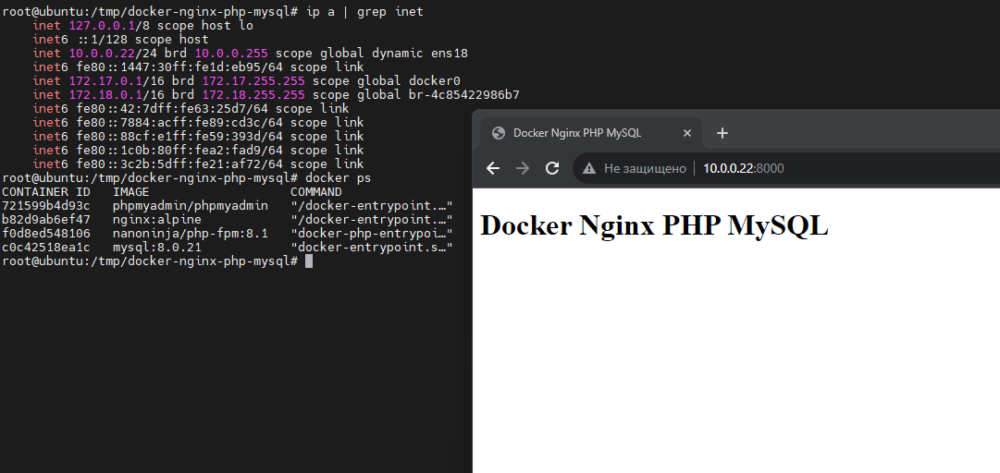

## 1

Написать Dockerfile для React приложения. Можно сгенерировать ресурсы для веб-сайта (HTML/CSS/JS файлы) прямо из исходников, а можно уже взять готовые из папки build. Собрать образ, запустить и проверить работоспособность приложения в контейнере.

```
# tree
.
├── Dockerfile
├── package.json
├── package-lock.json
├── public
│   ├── favicon.ico
│   ├── index.html
│   ├── logo192.png
│   ├── logo512.png
│   ├── manifest.json
│   └── robots.txt
├── README.md
└── src
    ├── App.css
    ├── App.js
    ├── App.test.js
    ├── index.css
    ├── index.js
    ├── logo.svg
    ├── pages
    │   ├── Blogs.js
    │   ├── Contact.js
    │   ├── Home.js
    │   ├── Layout.js
    │   └── NoPage.js
    ├── reportWebVitals.js
    └── setupTests.js

# cat Dockerfile
FROM node:slim AS build

WORKDIR /src

COPY package*.json ./
RUN npm ci

COPY . .
RUN npm run build

FROM nginx

COPY --from=build /src/build/ /usr/share/nginx/html

# docker build -t react_nginx .

# docker images
REPOSITORY    TAG       IMAGE ID       CREATED         SIZE
react_nginx   latest    c513d76621de   9 minutes ago   188MB

# docker run --rm --name react_nginx -p 888:80 react_nginx
```



## 2

Написать Dockerfile для LAMP приложения, который устанавливает весь LAMP стек в один образ. Подсказка: для того, чтобы в Docker контейнере запускались службы, нужно установить systemd и задать его как ENTRYPOINT, а также запускать контейнер в привилегированном режиме. Например, как тут.


├── [Dockerfile](2/Dockerfile)
├── [run.sh](2/run.sh)
├── [start-apache2.sh](2/start-apache2.sh)
├── [start-mysqld.sh](2/start-mysqld.sh)
├── [supervisord-apache2.conf](2/supervisord-apache2.conf)
├── [supervisord.conf](2/supervisord.conf)
└── [supervisord-mysqld.conf](2/supervisord-mysqld.conf)
```
# tree
.
├── [Dockerfile](2/Dockerfile)
├── [run.sh](2/run.sh)
├── [start-apache2.sh](2/start-apache2.sh)
├── [start-mysqld.sh](2/start-mysqld.sh)
├── [supervisord-apache2.conf](2/supervisord-apache2.conf)
├── [supervisord.conf](2/supervisord.conf)
└── [supervisord-mysqld.conf](2/supervisord-mysqld.conf)

0 directories, 7 files

# docker build -t simple-lamp .
[+] Building 66.4s (8/14)
...........
 => exporting to image                                                                                                                                                                                   3.8s
 => => exporting layers                                                                                                                                                                                  3.8s
 => => writing image sha256:3b1e0c7426dc36791cec90112ebe051bcf735fc3bb412c5156d1be9224bb990f                                                                                                             0.0s
 => => naming to docker.io/library/simple-lamp

 # docker images
REPOSITORY        TAG       IMAGE ID       CREATED         SIZE
simple-lamp       latest    3b1e0c7426dc   5 minutes ago   806MB

# docker run --rm --name simple-lamp -p 888:80 simple-lamp
Editing APACHE_RUN_GROUP environment variable
Editing phpmyadmin config
sed: can't read /var/www/phpmyadmin/config.inc.php: No such file or directory
Setting up MySQL directories
Allowing Apache/PHP to write to the app
chown: cannot access '/app': No such file or directory
Allowing Apache/PHP to write to MySQL
Removing MySQL socket
Editing MySQL config
=> Using an existing volume of MySQL
Starting supervisord
/usr/lib/python2.7/dist-packages/supervisor/options.py:297: UserWarning: Supervisord is running as root and it is searching for its configuration file in default locations (including its current working directory); you probably want to specify a "-c" argument specifying an absolute path to a configuration file for improved security.
  'Supervisord is running as root and it is searching '
2023-10-08 18:50:37,512 CRIT Supervisor running as root (no user in config file)
2023-10-08 18:50:37,512 WARN Included extra file "/etc/supervisor/conf.d/supervisord-apache2.conf" during parsing
2023-10-08 18:50:37,512 WARN Included extra file "/etc/supervisor/conf.d/supervisord-mysqld.conf" during parsing
2023-10-08 18:50:37,512 WARN Included extra file "/etc/supervisor/conf.d/supervisord.conf" during parsing
2023-10-08 18:50:37,520 INFO RPC interface 'supervisor' initialized
2023-10-08 18:50:37,520 CRIT Server 'unix_http_server' running without any HTTP authentication checking
2023-10-08 18:50:37,521 INFO supervisord started with pid 1
2023-10-08 18:50:38,523 INFO spawned: 'mysqld' with pid 27
2023-10-08 18:50:38,525 INFO spawned: 'apache2' with pid 28
2023-10-08 18:50:38,532 INFO exited: mysqld (exit status 0; not expected)
2023-10-08 18:50:39,583 INFO spawned: 'mysqld' with pid 397
2023-10-08 18:50:39,585 INFO success: apache2 entered RUNNING state, process has stayed up for > than 1 seconds (startsecs)
2023-10-08 18:50:39,590 INFO exited: mysqld (exit status 0; not expected)
2023-10-08 18:50:41,539 INFO reaped unknown pid 29
```



## 3

Написать Dockerfile для LAMP приложения, который устанавливает только само приложение в Apache. Написать docker-compose.yaml, который разворачивает зависимости приложения (MySQL и Memcached) и запускает само приложение. Обратить внимание на /docker-entrypoint-initdb.d mount для MySQL, использование которого описано в документации к MySQL Docker образу. Посмотреть, что такое wait-for-it.sh и придумать, как его можно заиспользовать в этом задании.


├── [docker-compose.yaml](3/docker-compose.yaml)
├── [Dockerfile](3/Dockerfile)
├── [.env](3/.env)
├── [info.php](3/info.php)
├── [simple-lamp.conf](3/simple-lamp.conf)
└── [simple_lamp.sql](3/simple_lamp.sql)
```
# tree -a
.
├── docker-compose.yaml
├── Dockerfile
├── .env
├── info.php
├── simple-lamp.conf
└── simple_lamp.sql

# docker build -t simple-lamp .
[+] Building 125.4s (12/12) FINISHED                                                                                                                                                           docker:default
 => [internal] load .dockerignore                                                                                                                                                                        0.0s
 => => transferring context: 2B
 ..........
 => => writing image sha256:f5d3a0f87f160a7f25adbce9fc1d7854b5d74670fca77712251b14f063d66cab                                                                                                             0.0s
 => => naming to docker.io/library/simple-lamp

#docker run --rm simple-lamp cat /var/www/simple-lamp/simple_lamp.sql > simple_lamp.sql

# docker-compose build
mysql uses an image, skipping
simple-lamp uses an image, skipping
memcached uses an image, skipping

# docker-compose up
Creating network "3_default" with the default driver
Pulling mysql (mysql:latest)...
latest: Pulling from library/mysql
..........
Digest: sha256:bcd4760922befbfcc813d368f7e1cfe38cce820126c627b20afac871b1c3829d
Status: Downloaded newer image for memcached:latest
Creating mysql     ... done
Creating memcached ... done
Creating 3_simple-lamp_1 ... done
Attaching to memcached, mysql, 3_simple-lamp_1
..........
mysql          | 2023-10-10 16:26:45+00:00 [Note] [Entrypoint]: /usr/local/bin/docker-entrypoint.sh: running /docker-entrypoint-initdb.d/simple_lamp.sql
..........
mysql          | 2023-10-10T16:26:48.523946Z 0 [System] [MY-011323] [Server] X Plugin ready for connections. Bind-address: '::' port: 33060, socket: /var/run/mysqld/mysqlx.sock
mysql          | 2023-10-10T16:26:48.524284Z 0 [System] [MY-010931] [Server] /usr/sbin/mysqld: ready for connections. Version: '8.1.0'  socket: '/var/run/mysqld/mysqld.sock'  port: 3306  MySQL Community Server - GPL.
```



## 4

Запустить Java приложение с помощью docker-compose.yml, находящемся в репозитории.

├── [docker-compose.yaml](4/docker-compose.yaml)
├── [Dockerfile](4/Dockerfile)
```
# tree
.
├── docker-compose.yaml
└── Dockerfile

# docker build -t java-mongo-hello-world .
[+] Building 0.0s (8/8) FINISHED                                                                                                                                                               docker:default
 => [internal] load build definition from Dockerfile                                                                                                                                                     0.0s
 .............
 => => writing image sha256:8e780ef350455a844909468e01a9c67800c0f82a99ff638a29a2a5323bd1c75c                                                                                                             0.0s
 => => naming to docker.io/library/java-mongo-hello-world

# docker-compose up
Starting 4_mongodb_1 ... done
Starting 4_app_1     ... done
Attaching to 4_mongodb_1, 4_app_1
mongodb_1  | {"t":{"$date":"2023-10-11T07:30:18.784+00:00"},"s":"I",  "c":"CONTROL",  "id":23285,   "ctx":"main","msg":"Automatically disabling TLS 1.0, to force-enable TLS 1.0 specify --sslDisabledProtocols 'none'"}
................
app_1      | Oct 11, 2023 7:30:20 AM com.mongodb.diagnostics.logging.JULLogger log
app_1      | INFO: Opened connection [connectionId{localValue:3, serverValue:2}] to mongodb:27017
app_1      | Hello World!
app_1      | Oct 11, 2023 7:30:20 AM com.mongodb.diagnostics.logging.JULLogger log
app_1      | INFO: Closed connection [connectionId{localValue:3, serverValue:2}] to mongodb:27017 because the pool has been closed.
mongodb_1  | {"t":{"$date":"2023-10-11T07:30:20.576+00:00"},"s":"I",  "c":"NETWORK",  "id":22944,   "ctx":"conn2","msg":"Connection ended","attr":{"remote":"172.28.0.3:34012","connectionId":2,"connectionCount":1}}
mongodb_1  | {"t":{"$date":"2023-10-11T07:30:20.577+00:00"},"s":"I",  "c":"NETWORK",  "id":22944,   "ctx":"conn1","msg":"Connection ended","attr":{"remote":"172.28.0.3:33996","connectionId":1,"connectionCount":0}}
4_app_1 exited with code 0

# docker ps
CONTAINER ID   IMAGE         COMMAND                  CREATED          STATUS          PORTS       NAMES
fd2f4a6f70fc   mongo:4.4.3   "docker-entrypoint.s…"   50 minutes ago   Up 12 minutes   27017/tcp   4_mongodb_1

# docker exec -it 4_mongodb_1 /bin/bash

root@fd2f4a6f70fc:/# mongo
> show dbs
admin   0.000GB
config  0.000GB
local   0.000GB
mydb    0.000GB
> use mydb
switched to db mydb
> db.getCollectionNames()
[ "examples" ]
```


## 5

Написать Ansible playbook, который будет устанавливать Docker и Docker Compose на целевую VM с помощью роли, а затем будет запускать одно из следующих приложений с помощью Docker Compose:
- LAMP приложение
- Java приложение
- Nginx/PHP/MySQL приложение
Продумать какие переменные будут доступны для пользователя Ansible playbook и каким образом они будут встраиваться в docker-compose.yml.

├── [docker-install.yml](5/docker-install.yml)
├── [servers](5/servers)
└── [docker-install.yml](5/vars/docker-install.yml)
```
$ tree
.
├── docker-install.yml
├── servers
└── vars
    └── docker-install.yml

$ ansible-playbook docker-install.yml -i servers -K
BECOME password:

PLAY [Roles Configuration] ***********************************************************************************************************************************************************************************

TASK [Gathering Facts] ***************************************************************************************************************************************************************************************
ok: [10.0.0.22]

TASK [geerlingguy.docker : Load OS-specific vars.] ***********************************************************************************************************************************************************
ok: [10.0.0.22]
..........
TASK [Deploy Docker Compose stack] ***************************************************************************************************************************************************************************
changed: [10.0.0.22]

PLAY RECAP *********************************************************************
********************************************************************************                                                                                                             **********************************************
10.0.0.22: ok=19   changed=3    unreachable=0    failed=0    
skipped=13   rescued=0    ignored=0
```



## 6

В качестве эксперимента, установить некоторую зависимость приложения (например, БД) из предыдущего пункта как сервис на VM при помощи Ansible роли. Само приложение оставить в Docker и настроить на работу с зависимостью на VM.

```

```