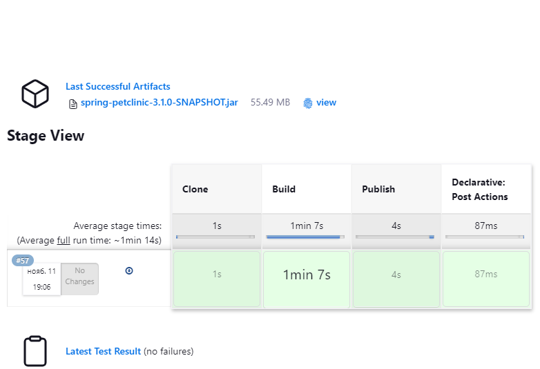

## 1

Познакомиться с описанием проекта spring-petclinic, изучить какие инструменты нужны для его сборки.

```
Maven or Gradle. You can build a jar file and run it from the command line (it should work just as well with Java 17 or newer)
```


## 2

Создать статический Jenkins агент (можно использовать WSL), установить туда инструменты, необходимые для сборки проекта.

```
# apt-get update
# apt install -y --no-install-recommends openjdk-17-jdk-headless
$ java -version
openjdk version 17.0.8.1 2023-08-24
OpenJDK Runtime Environment (build 17.0.8.1+1-Ubuntu-0ubuntu120.04)
OpenJDK 64-Bit Server VM (build 17.0.8.1+1-Ubuntu-0ubuntu120.04, mixed mode, sharing)

# apt install maven
```


## 3

Реализовать Jenkinsfile для проекта, который состоит из следующих этапов (stages):
- Clone
- Клонируется данный проект. Обратите внимание, что этот репозиторий приватный и для того, чтобы его склонировать нужно использовать какие-то credentials. Необходимо создать нужные credentials в Jenkins и сослаться на них при написании pipeline.
- Build
- Происходит сборка проекта через Maven или Gradle и запускаются юнит-тесты.
- Publish
- Публикуется артефакт сборки с помощью инструкции archiveArtifacts.
- Публикуется отчёт тестирования с помощью инструкции junit.

[Jenkinsfile](Jenkinsfile_HW26_3)
```
[INFO] Results:
[INFO] 
[WARNING] Tests run: 45, Failures: 0, Errors: 0, Skipped: 2
[INFO] 
[INFO] ------------------------------------------------------------------------
[INFO] BUILD SUCCESS
[INFO] ------------------------------------------------------------------------
[INFO] Total time:  30.790 s
[INFO] Finished at: 2023-11-11T18:36:10Z
[INFO] ------------------------------------------------------------------------
[Pipeline] }
[Pipeline] // dir
[Pipeline] }
[Pipeline] // stage
[Pipeline] stage
[Pipeline] { (Publish)
[Pipeline] dir
Running in /tmp/workspace/hw25/spring-petclinic
[Pipeline] {
[Pipeline] archiveArtifacts
Archiving artifacts
[Pipeline] junit
Recording test results
[Checks API] No suitable checks publisher found.
[Pipeline] }
[Pipeline] // dir
[Pipeline] }
[Pipeline] // stage
[Pipeline] stage
[Pipeline] { (Declarative: Post Actions)
[Pipeline] junit
Recording test results
[Checks API] No suitable checks publisher found.
[Pipeline] }
[Pipeline] // stage
[Pipeline] }
[Pipeline] // node
[Pipeline] End of Pipeline
Finished: SUCCESS
```



## 4

Настроить сборку по расписанию (каждый час) при помощи блока triggers в Jenkinsfile.

```
    triggers {
        cron "0 * * * *"
    }
```


## 5

Реализовать Dockerfile для данного проекта и изменить стадию Build таким образом, чтобы она строила Docker образ. Стадию Publish в данном случае можно пропустить.

[Jenkinsfile](Jenkinsfile_HW26_4)
```
............
[INFO]     [creator]     Saving docker.io/library/spring-petclinic:3.1.0-SNAPSHOT...
[INFO]     [creator]     *** Images (c162697614ca):
[INFO]     [creator]           docker.io/library/spring-petclinic:3.1.0-SNAPSHOT
[INFO]     [creator]     Adding cache layer 'paketo-buildpacks/syft:syft'
[INFO]     [creator]     Adding cache layer 'buildpacksio/lifecycle:cache.sbom'
[INFO] 
[INFO] Successfully built image 'docker.io/library/spring-petclinic:3.1.0-SNAPSHOT'
[INFO] 
[INFO] ------------------------------------------------------------------------
[INFO] BUILD SUCCESS
[INFO] ------------------------------------------------------------------------
[INFO] Total time:  05:35 min
[INFO] Finished at: 2023-11-12T12:20:55Z
[INFO] ------------------------------------------------------------------------
............


$ docker run --name petclinic -p 8080:8080 c162697614ca
Setting Active Processor Count to 2
Calculating JVM memory based on 1455828K available memory
For more information on this calculation, see https://paketo.io/docs/reference/java-reference/#memory-calculator
Calculated JVM Memory Configuration: -XX:MaxDirectMemorySize=10M -Xmx825591K -XX:MaxMetaspaceSize=118236K -XX:ReservedCodeCacheSize=240M -Xss1M (Total Memory: 1455828K, Thread Count: 250, Loaded Class Count: 18461, Headroom: 0%)
Enabling Java Native Memory Tracking
Adding 137 container CA certificates to JVM truststore
Spring Cloud Bindings Enabled
Picked up JAVA_TOOL_OPTIONS: -Djava.security.properties=/layers/paketo-buildpacks_bellsoft-liberica/java-security-properties/java-security.properties -XX:+ExitOnOutOfMemoryError -XX:ActiveProcessorCount=2 -XX:MaxDirectMemorySize=10M -Xmx825591K -XX:MaxMetaspaceSize=118236K -XX:ReservedCodeCacheSize=240M -Xss1M -XX:+UnlockDiagnosticVMOptions -XX:NativeMemoryTracking=summary -XX:+PrintNMTStatistics -Dorg.springframework.cloud.bindings.boot.enable=true


              |\      _,,,--,,_
             /,`.-'`'   ._  \-;;,_
  _______ __|,4-  ) )_   .;.(__`'-'__     ___ __    _ ___ _______
 |       | '---''(_/._)-'(_\_)   |   |   |   |  |  | |   |       |
 |    _  |    ___|_     _|       |   |   |   |   |_| |   |       | __ _ _
 |   |_| |   |___  |   | |       |   |   |   |       |   |       | \ \ \ \
 |    ___|    ___| |   | |      _|   |___|   |  _    |   |      _|  \ \ \ \
 |   |   |   |___  |   | |     |_|       |   | | |   |   |     |_    ) ) ) )
 |___|   |_______| |___| |_______|_______|___|_|  |__|___|_______|  / / / /
 ==================================================================/_/_/_/

:: Built with Spring Boot :: 3.1.3


2023-11-12T12:40:03.946Z  INFO 1 --- [           main] o.s.s.petclinic.PetClinicApplication     : Starting PetClinicApplication v3.1.0-SNAPSHOT using Java 17.0.7 with PID 1 (/workspace/BOOT-INF/classes started by cnb in /workspace)
2023-11-12T12:40:03.950Z  INFO 1 --- [           main] o.s.s.petclinic.PetClinicApplication     : No active profile set, falling back to 1 default profile: "default"
2023-11-12T12:40:05.698Z  INFO 1 --- [           main] .s.d.r.c.RepositoryConfigurationDelegate : Bootstrapping Spring Data JPA repositories in DEFAULT mode.
2023-11-12T12:40:05.769Z  INFO 1 --- [           main] .s.d.r.c.RepositoryConfigurationDelegate : Finished Spring Data repository scanning in 59 ms. Found 2 JPA repository interfaces.
2023-11-12T12:40:06.491Z  INFO 1 --- [           main] o.s.b.w.embedded.tomcat.TomcatWebServer  : Tomcat initialized with port(s): 8080 (http)
2023-11-12T12:40:06.504Z  INFO 1 --- [           main] o.apache.catalina.core.StandardService   : Starting service [Tomcat]
2023-11-12T12:40:06.504Z  INFO 1 --- [           main] o.apache.catalina.core.StandardEngine    : Starting Servlet engine: [Apache Tomcat/10.1.12]
2023-11-12T12:40:06.597Z  INFO 1 --- [           main] o.a.c.c.C.[Tomcat].[localhost].[/]       : Initializing Spring embedded WebApplicationContext
2023-11-12T12:40:06.599Z  INFO 1 --- [           main] w.s.c.ServletWebServerApplicationContext : Root WebApplicationContext: initialization completed in 2537 ms
2023-11-12T12:40:06.880Z  INFO 1 --- [           main] com.zaxxer.hikari.HikariDataSource       : HikariPool-1 - Starting...
2023-11-12T12:40:07.187Z  INFO 1 --- [           main] com.zaxxer.hikari.pool.HikariPool        : HikariPool-1 - Added connection conn0: url=jdbc:h2:mem:d0aa13c0-001c-4661-98e2-8fd3bb8b1ca6 user=SA
2023-11-12T12:40:07.190Z  INFO 1 --- [           main] com.zaxxer.hikari.HikariDataSource       : HikariPool-1 - Start completed.
2023-11-12T12:40:07.349Z  INFO 1 --- [           main] o.hibernate.jpa.internal.util.LogHelper  : HHH000204: Processing PersistenceUnitInfo [name: default]
2023-11-12T12:40:07.413Z  INFO 1 --- [           main] org.hibernate.Version                    : HHH000412: Hibernate ORM core version 6.2.7.Final
2023-11-12T12:40:07.416Z  INFO 1 --- [           main] org.hibernate.cfg.Environment            : HHH000406: Using bytecode reflection optimizer
2023-11-12T12:40:07.574Z  INFO 1 --- [           main] o.h.b.i.BytecodeProviderInitiator        : HHH000021: Bytecode provider name : bytebuddy
2023-11-12T12:40:07.720Z  INFO 1 --- [           main] o.s.o.j.p.SpringPersistenceUnitInfo      : No LoadTimeWeaver setup: ignoring JPA class transformer
2023-11-12T12:40:08.104Z  INFO 1 --- [           main] o.h.b.i.BytecodeProviderInitiator        : HHH000021: Bytecode provider name : bytebuddy
2023-11-12T12:40:09.140Z  INFO 1 --- [           main] o.h.e.t.j.p.i.JtaPlatformInitiator       : HHH000490: Using JtaPlatform implementation: [org.hibernate.engine.transaction.jta.platform.internal.NoJtaPlatform]
2023-11-12T12:40:09.144Z  INFO 1 --- [           main] j.LocalContainerEntityManagerFactoryBean : Initialized JPA EntityManagerFactory for persistence unit 'default'
2023-11-12T12:40:09.438Z  INFO 1 --- [           main] o.s.d.j.r.query.QueryEnhancerFactory     : Hibernate is in classpath; If applicable, HQL parser will be used.
2023-11-12T12:40:11.009Z  INFO 1 --- [           main] o.s.b.a.e.web.EndpointLinksResolver      : Exposing 13 endpoint(s) beneath base path '/actuator'
2023-11-12T12:40:11.183Z  INFO 1 --- [           main] o.s.b.w.embedded.tomcat.TomcatWebServer  : Tomcat started on port(s): 8080 (http) with context path ''
2023-11-12T12:40:11.204Z  INFO 1 --- [           main] o.s.s.petclinic.PetClinicApplication     : Started PetClinicApplication in 7.784 seconds (process running for 8.224)
2023-11-12T12:40:20.643Z  INFO 1 --- [nio-8080-exec-1] o.a.c.c.C.[Tomcat].[localhost].[/]       : Initializing Spring DispatcherServlet 'dispatcherServlet'
2023-11-12T12:40:20.643Z  INFO 1 --- [nio-8080-exec-1] o.s.web.servlet.DispatcherServlet        : Initializing Servlet 'dispatcherServlet'
2023-11-12T12:40:20.645Z  INFO 1 --- [nio-8080-exec-1] o.s.web.servlet.DispatcherServlet        : Completed initialization in 2 ms
```
