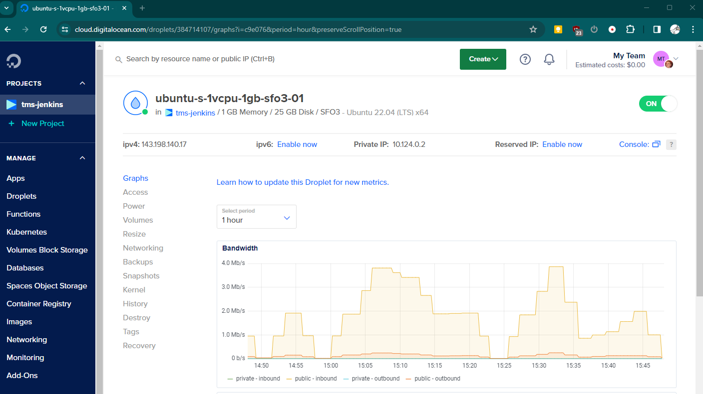
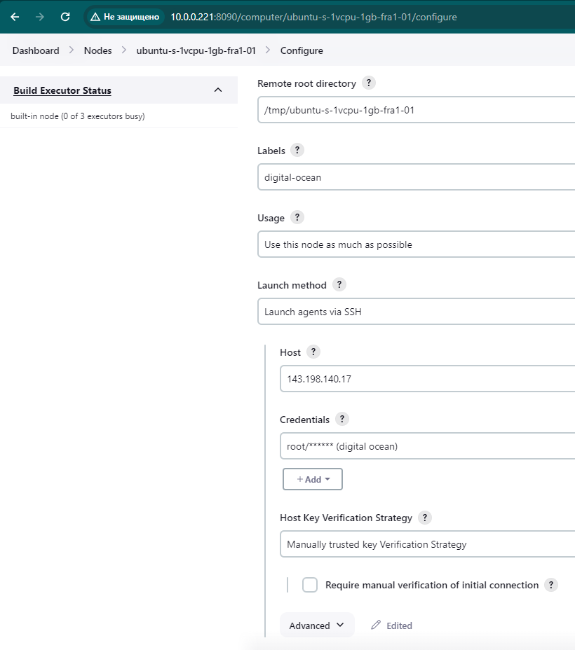
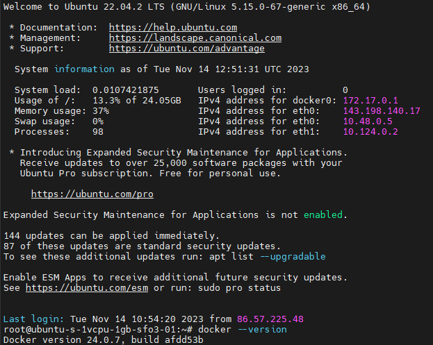
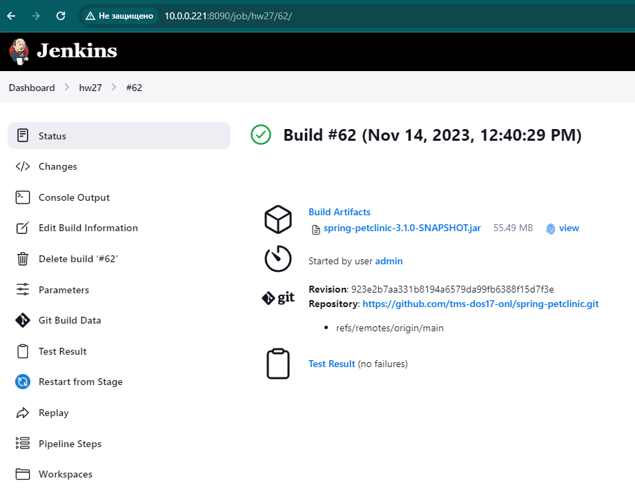

## 1

Создать новый Jenkins агент и установить на нём Docker.

```
Сделано. Ниже скрины
```





## 2

Изменить Jenkinsfile из предыдущего домашнего задания путём добавления стадии "Integration Tests" между стадиями Build и Publish. Она должна запускаться в Docker контейнере на созданном ранее Jenkins агенте при помощи Docker Pipeline плагина и выполнять следующие шаги:
- Запуск приложения в фоновом режиме.
- Проверка работоспособности приложения при помощи curl.

Для передачи артефактов между агентами использовать stash/unstash.

[Jenkinsfile](Jenkinsfile)
[consoleOutput](PiplineConsoleOutput)
```
Сборка артефакта происходит на proxmox ноде, после stash target/*.jar и unstash в контернере который находится в облаке DigitalOcean. Параллельно с запуском приложения в контейнере проверяю через curl его доступность с proxmox ноды

[Checks API] No suitable checks publisher found.
[Pipeline] }
[Pipeline] // dir
[Pipeline] }
[Pipeline] // stage
[Pipeline] stage
[Pipeline] { (Declarative: Post Actions)
[Pipeline] junit
Recording test results
[Checks API] No suitable checks publisher found.
[Pipeline] }
[Pipeline] // stage
[Pipeline] }
[Pipeline] // node
[Pipeline] End of Pipeline
Finished: SUCCESS
```

