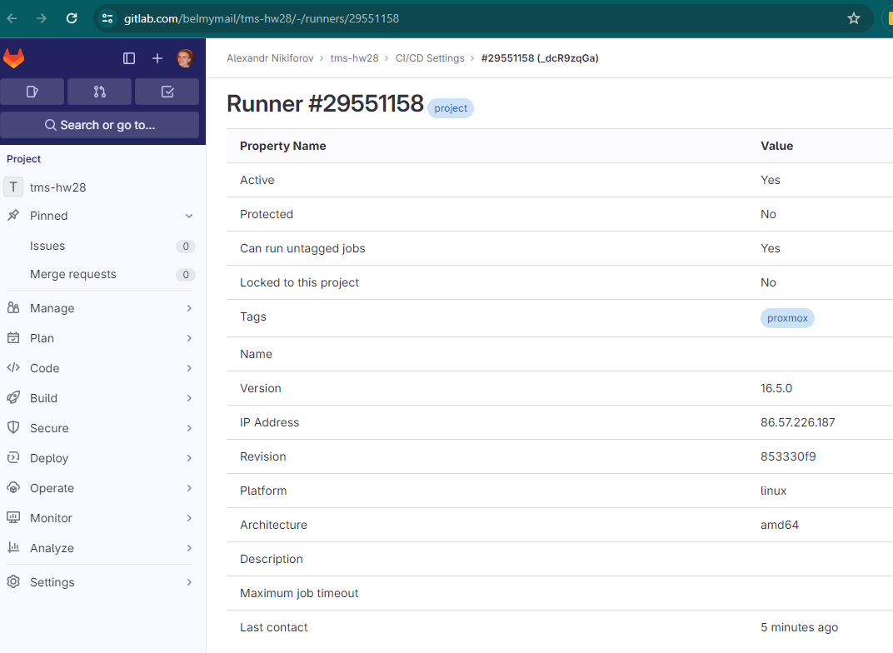
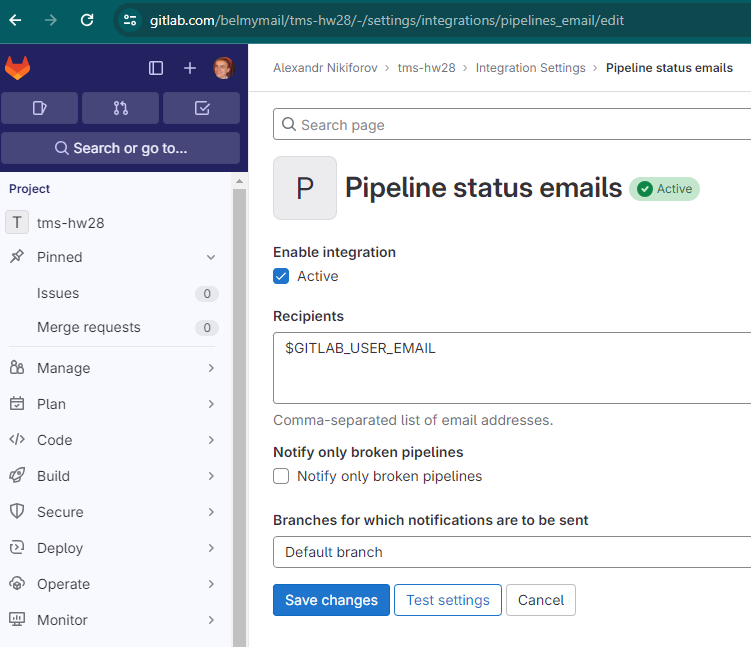
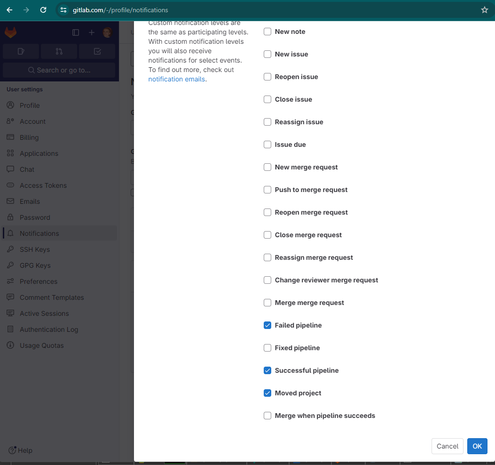
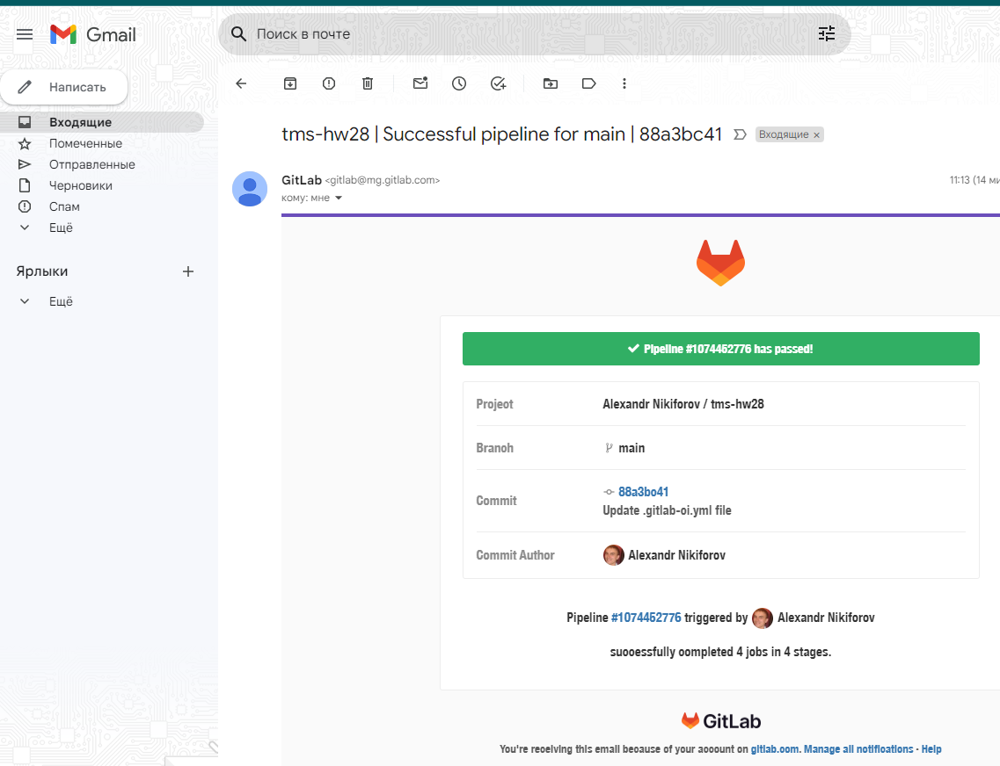

## 1

Зарегестрироваться на любой облачной CI платформе (например BitBucket, GitLab, GitHub).

```
сделано
```


## 2

Реализовать pipeline для проекта spring-petclinic, который состоит из следующих этапов (stages):
- Clone
- Клонируется данный проект. Обратите внимание, что этот репозиторий приватный и для того, чтобы его склонировать нужно использовать какие-то credentials.
- Build
- Происходит сборка проекта через Maven или Gradle и запускаются юнит-тесты.
- Publish
- Публикуется отчёт тестирования.
- Notification
- Отправляется письмо с результатом сборки, тому кто её запустил.

```
Установил свой runner на виртуалку и отключил sharred runners

$ curl -LJO "https://gitlab-runner-downloads.s3.amazonaws.com/latest/deb/gitlab-runner_amd64.deb"
# dpkg -i gitlab-runner_amd64.deb
# systemctl enable gitlab-runner --now
# systemctl status gitlab-runner
● gitlab-runner.service - GitLab Runner
     Loaded: loaded (/etc/systemd/system/gitlab-runner.service; enabled; vendor preset: enabled)
     Active: active (running) since Thu 2023-11-16 07:11:44 UTC; 1h 15min ago
   Main PID: 3138 (gitlab-runner)
      Tasks: 9 (limit: 2256)
     Memory: 24.2M
     CGroup: /system.slice/gitlab-runner.service
             └─3138 /usr/bin/gitlab-runner run --working-directory /var/lib/gitlab-runner --config /etc/gitlab-runner/config.toml --service gitlab-runner --user gitlab-runner

# gitlab-runner register  --url https://gitlab.com  --token glrt-_dcR9zqGahcAQwY7-QMT


stages:
  - clone
  - build
  - publish
  - notification

cache:
  paths:
    - .

clone-job:
  stage: clone
  script:
    - rm -Rf spring-petclinic
    - git clone https://$GITHUB_CI_JOB_TOKEN@github.com/tms-dos17-onl/spring-petclinic.git
    - tree
    - pwd

build-job:
  stage: build
  script:
    - tree
    - ./spring-petclinic/mvnw package -f ./spring-petclinic/pom.xml
    - ./spring-petclinic/mvnw test -f ./spring-petclinic/pom.xml

publish-job:
  stage: publish
  artifacts:
    reports:
      junit:
        - ./spring-petclinic/target/surefire-reports/*.xml
  script:
    - tree

notification-job:
  stage: notification
  script:
    - echo report will be send to $GITLAB_USER_EMAIL
```



