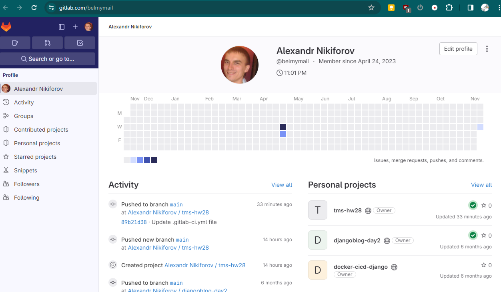

## 1

Зарегестрироваться на любой облачной CI платформе (например BitBucket, GitLab, GitHub).

```
сделано
```



## 2

Реализовать pipeline для проекта spring-petclinic, который состоит из следующих этапов (stages):
- Clone
- Клонируется данный проект. Обратите внимание, что этот репозиторий приватный и для того, чтобы его склонировать нужно использовать какие-то credentials.
- Build
- Происходит сборка проекта через Maven или Gradle и запускаются юнит-тесты.
- Publish
- Публикуется отчёт тестирования.
- Notification
- Отправляется письмо с результатом сборки, тому кто её запустил.

```

```
