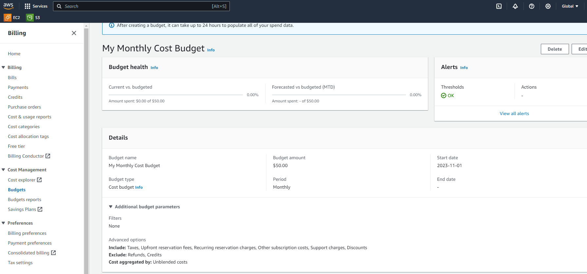
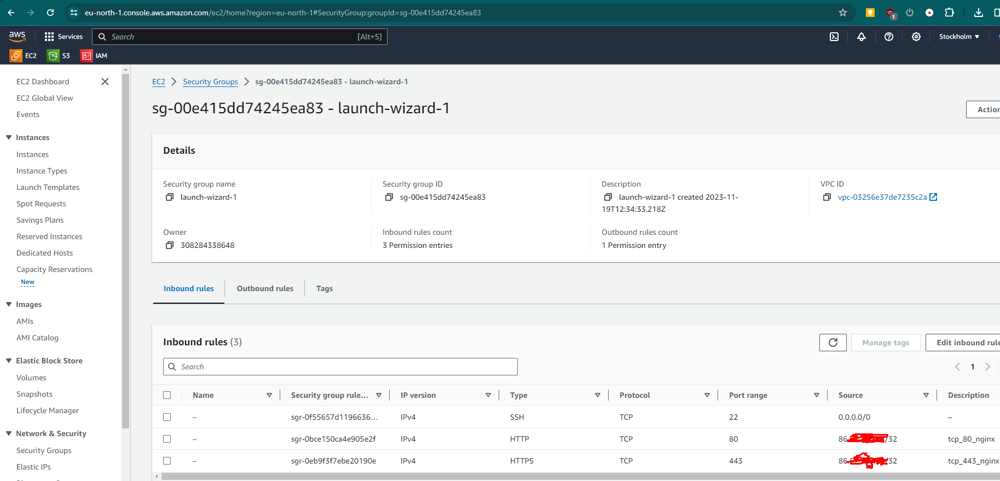

## 1

Зарегистрироваться на облачном провайдере Google Cloud Platform (GCP)
- В качестве локации указать Грузию.
- Привязать банковскую карту РБ/РФ.
- Получить кредиты от GCP (300$) путем верификации карты.

```
сделано
```


## 2

Настроить предупреждения для бюджета (например, 50$ на месяц).

```
сделано
```



## 3

Создать свою первую VM в облаке, зайти на неё по SSH и установить Nginx/Apache.

[ec2_instance](ec2_instance)
```

   ,     #_
   ~\_  ####_        Amazon Linux 2023
  ~~  \_#####\
  ~~     \###|
  ~~       \#/ ___   https://aws.amazon.com/linux/amazon-linux-2023
   ~~       V~' '->
    ~~~         /
      ~~._.   _/
         _/ _/
       _/m/'
[ec2-user@ip-172-31-16-226 ~]$ hostname
ip-172-31-16-226.eu-north-1.compute.internal
[ec2-user@ip-172-31-16-226 ~]$ ip a
1: lo: <LOOPBACK,UP,LOWER_UP> mtu 65536 qdisc noqueue state UNKNOWN group default qlen 1000
    link/loopback 00:00:00:00:00:00 brd 00:00:00:00:00:00
    inet 127.0.0.1/8 scope host lo
       valid_lft forever preferred_lft forever
    inet6 ::1/128 scope host noprefixroute
       valid_lft forever preferred_lft forever
2: ens5: <BROADCAST,MULTICAST,UP,LOWER_UP> mtu 9001 qdisc mq state UP group default qlen 1000
    link/ether 06:a8:7b:fc:72:54 brd ff:ff:ff:ff:ff:ff
    altname enp0s5
    altname eni-0a2a3edd665e91c4b
    altname device-number-0
    inet 172.31.16.226/20 metric 512 brd 172.31.31.255 scope global dynamic ens5
       valid_lft 3009sec preferred_lft 3009sec
    inet6 fe80::4a8:7bff:fefc:7254/64 scope link
       valid_lft forever preferred_lft forever

$ sudo su -
Last login: Sun Nov 19 12:53:31 UTC 2023 from 86.57.225.48 on pts/0

# yum install nginx
Last metadata expiration check: 0:12:29 ago on Sun Nov 19 12:44:33 2023.
Dependencies resolved.
```


## 4

Создать Firewall правило для подключения к этой VM со своей локальной машины по порту 80. Проверить, что доступ работает.

```
# netstat -tulpan
Active Internet connections (servers and established)
Proto Recv-Q Send-Q Local Address           Foreign Address         State       PID/Program name
tcp        0      0 0.0.0.0:22              0.0.0.0:*               LISTEN      1670/sshd: /usr/sbi
tcp        0     64 172.31.16.226:22        86.57.225.48:41559      ESTABLISHED 2067/sshd: ec2-user
tcp6       0      0 :::22                   :::*                    LISTEN      1670/sshd: /usr/sbi
udp        0      0 127.0.0.1:323           0.0.0.0:*                           1700/chronyd
udp        0      0 172.31.16.226:68        0.0.0.0:*                           1427/systemd-networ
udp6       0      0 ::1:323                 :::*                                1700/chronyd
udp6       0      0 fe80::4a8:7bff:fefc:546 :::*                                1427/systemd-networ

# yum install firewalld
Last metadata expiration check: 0:22:08 ago on Sun Nov 19 12:44:33 2023.
Dependencies resolved.

# systemctl start firewalld
[root@ip-172-31-16-226 ~]# systemctl status firewalld
● firewalld.service - firewalld - dynamic firewall daemon
     Loaded: loaded (/usr/lib/systemd/system/firewalld.service; enabled; preset: enabled)
     Active: active (running) since Sun 2023-11-19 13:09:02 UTC; 1s ago
       Docs: man:firewalld(1)
   Main PID: 31453 (firewalld)
      Tasks: 2 (limit: 1061)
     Memory: 23.6M
        CPU: 405ms
     CGroup: /system.slice/firewalld.service
             └─31453 /usr/bin/python3 -s /usr/sbin/firewalld --nofork --nopid

# firewall-cmd --get-zones
FedoraServer FedoraWorkstation block dmz drop external home internal public trusted work

# firewall-cmd --permanent --add-port=80/tcp
success
# firewall-cmd --permanent --add-port=443/tcp
success

# systemctl start nginx
# systemctl status nginx
● nginx.service - The nginx HTTP and reverse proxy server
     Loaded: loaded (/usr/lib/systemd/system/nginx.service; disabled; preset: disabled)
     Active: active (running) since Sun 2023-11-19 13:11:08 UTC; 2s ago
    Process: 32334 ExecStartPre=/usr/bin/rm -f /run/nginx.pid (code=exited, status=0/SUCCESS)
    Process: 32339 ExecStartPre=/usr/sbin/nginx -t (code=exited, status=0/SUCCESS)
    Process: 32342 ExecStart=/usr/sbin/nginx (code=exited, status=0/SUCCESS)
   Main PID: 32343 (nginx)
      Tasks: 3 (limit: 1061)
     Memory: 2.9M
        CPU: 54ms
     CGroup: /system.slice/nginx.service
             ├─32343 "nginx: master process /usr/sbin/nginx"
             ├─32344 "nginx: worker process"
             └─32345 "nginx: worker process"

# netstat -tulpan
Active Internet connections (servers and established)
Proto Recv-Q Send-Q Local Address           Foreign Address         State       PID/Program name
tcp        0      0 0.0.0.0:22              0.0.0.0:*               LISTEN      1670/sshd: /usr/sbi
tcp        0      0 0.0.0.0:80              0.0.0.0:*               LISTEN      32343/nginx: master
tcp        0     64 172.31.16.226:22        86.57.225.48:41559      ESTABLISHED 2067/sshd: ec2-user
tcp6       0      0 :::22                   :::*                    LISTEN      1670/sshd: /usr/sbi
tcp6       0      0 :::80                   :::*                    LISTEN      32343/nginx: master
udp        0      0 127.0.0.1:323           0.0.0.0:*                           1700/chronyd
udp        0      0 172.31.16.226:68        0.0.0.0:*                           1427/systemd-networ
udp6       0      0 ::1:323                 :::*                                1700/chronyd
udp6       0      0 fe80::4a8:7bff:fefc:546 :::*                                1427/systemd-networ

# firewall-cmd --reload
success
```


