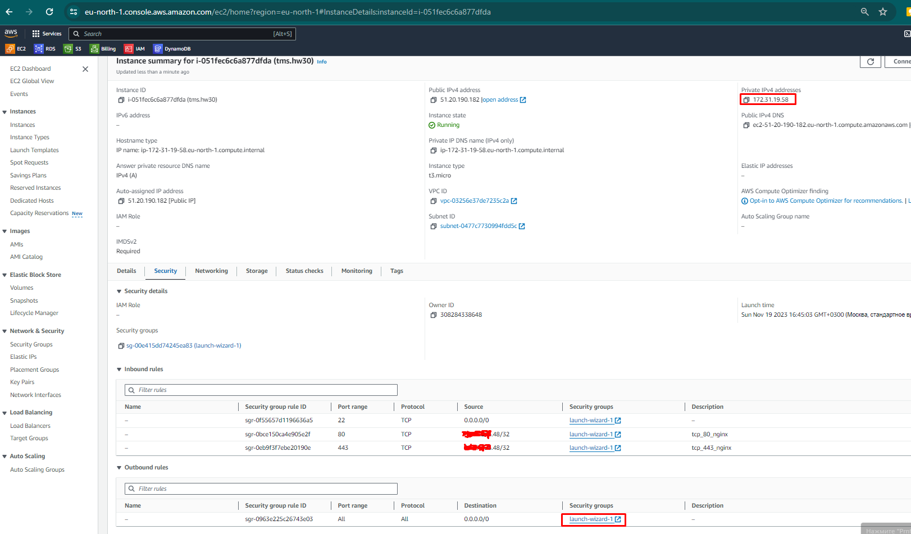
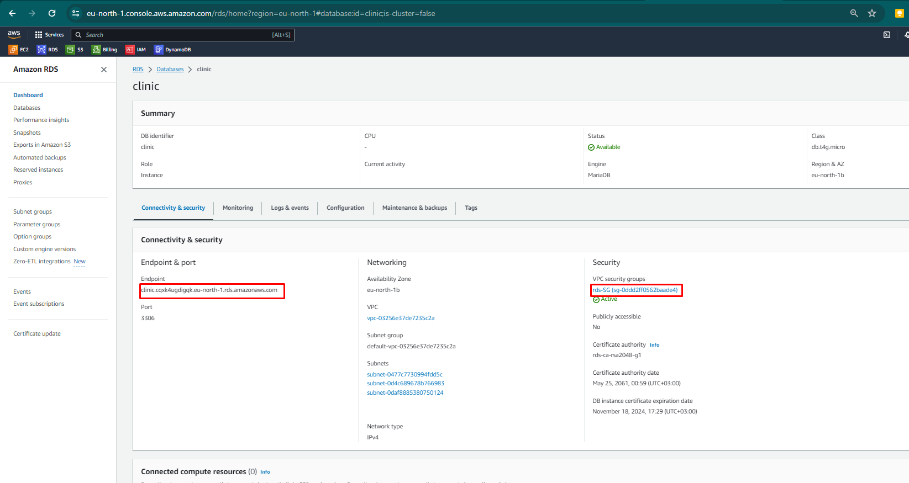
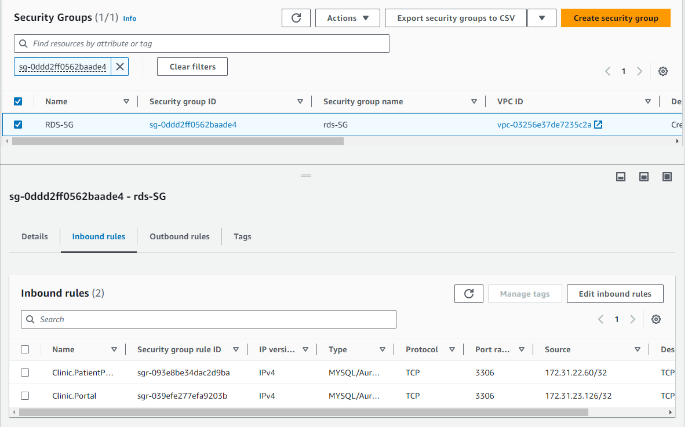

## 1

Установить приложение Clinic v1 в Google Cloud Platform согласно инструкции. Для хостинга БД использовать Google Cloud SQL поддержкой соединений только во внутренней сети (иными словами, БД будет доступна только по внутреннему/приватному IP). Сами сервисы установить на виртуальные машины Google Compute Engine (GCE) с ОС Debian 12. Проверить работоспособность приложения путём создания записи на приём к любому врачу.

```
# apt install mariadb-client
# mariadb --version
mariadb  Ver 15.1 Distrib 10.11.4-MariaDB, for debian-linux-gnu (x86_64) using  EditLine wrapper
# python3 --version
Python 3.11.2


# cat .initdb.d/clinic-portal.sql
START TRANSACTION;

CREATE DATABASE clinic;

ALTER DATABASE clinic  CHARACTER SET = utf8mb4 COLLATE = utf8mb4_unicode_ci;

USE clinic;

CREATE USER 'clinic' @'%' IDENTIFIED BY 'password';

GRANT ALL PRIVILEGES ON clinic.* TO 'clinic' @'%';

FLUSH PRIVILEGES;

SOURCE /var/www/clinic/portal/.initdb.d/clinic-portal/dump.sql;

COMMIT;


# mysql -h clinic.cqxk4ugdigqk.eu-north-1.rds.amazonaws.com -u admin -p
Enter password:
MariaDB [(none)]> source /var/www/clinic/portal/.initdb.d/clinic-portal.sql
...........
Query OK, 0 rows affected (0.001 sec)

MariaDB [clinic]> use clinic;
Database changed
MariaDB [clinic]> select * from Doctor;
+----+----------------+--------------------+------------+--------------------------------+---------------+-----------------------------+
| id | FirstName      | LastName           | BirthDate  | Address                        | Telephone     | Email                       |
+----+----------------+--------------------+------------+--------------------------------+---------------+-----------------------------+
|  1 | Андрей         | Быков              | 1966-06-22 | Тилимилитрямдия                | +37529XXXXXXX | andrey.bykov@clinic.com     |
|  2 | Иван           | Купитман           | 1963-03-13 | Тилимилитрямдия                | +37529XXXXXXX | ivan.kupitman@clinic.com    |
|  3 | Борис          | Левин              | 1986-01-15 | Тилимилитрямдия                | +37529XXXXXXX | dmitry.levin@clinic.com     |
|  4 | Варвара        | Черноус            | 1988-04-14 | Тилимилитрямдия                | +37529XXXXXXX | varvara.chernous@clinic.com |
|  5 | Глеб           | Романенко          | 1984-09-19 | Тилимилитрямдия                | +37529XXXXXXX | gleb.romanenko@clinic.com   |
|  6 | Семён          | Лобанов            | 1983-11-22 | Тилимилитрямдия                | +37529XXXXXXX | semen.lobanoff@clinic.com   |
+----+----------------+--------------------+------------+--------------------------------+---------------+-----------------------------+
6 rows in set (0.002 sec)
```




```
# python3 -m venv .venv

# . .venv/bin/activate

# cat .env
ALLOWED_HOSTS=16.170.140.16
SECRET_KEY=django-insecure-w6rzzkjq-j&fxq^9)1c+nj#zp3lp$kh8&h4fkw9yue8c$ygbuy

DB_HOST=clinic.cqxk4ugdigqk.eu-north-1.rds.amazonaws.com
DB_NAME=clinic
DB_USER=clinic
DB_PASSWORD=password

# pip install -r requirements.txt
..............
Installing collected packages: pytz, tzdata, sqlparse, python-dotenv, mysqlclient, asgiref, Django, djangorestframework
Successfully installed Django-4.2.5 asgiref-3.7.2 djangorestframework-3.14.0 mysqlclient-2.2.0 python-dotenv-1.0.0 pytz-2023.3.post1 sqlparse-0.4.4 tzdata-2023.3

# python3 manage.py runserver 0.0.0.0:8000
Watching for file changes with StatReloader
Performing system checks...

System check identified no issues (0 silenced).

You have 19 unapplied migration(s). Your project may not work properly until you apply the migrations for app(s): admin, auth, clinic_portal, contenttypes, sessions.
Run 'python manage.py migrate' to apply them.
November 21, 2023 - 08:36:00
Django version 4.2.5, using settings 'settings'
Starting development server at http://0.0.0.0:8000/
Quit the server with CONTROL-C.
```

```
# apt install mariadb-client
# wget https://packages.microsoft.com/config/debian/12/packages-microsoft-prod.deb -O packages-microsoft-prod.deb
# dpkg -i packages-microsoft-prod.deb
# rm packages-microsoft-prod.deb
# apt update && apt install -y dotnet-sdk-6.0
# openssl req -x509 -nodes -days 365 -subj "/CN=localhost" -newkey rsa:2048 -keyout cert.key -out cert.crt
# dotnet Clinic.PatientPortal.dll --urls https://0.0.0.0:8443
info: Microsoft.Hosting.Lifetime[14]
      Now listening on: https://0.0.0.0:8443
info: Microsoft.Hosting.Lifetime[0]
      Application started. Press Ctrl+C to shut down.
info: Microsoft.Hosting.Lifetime[0]
      Hosting environment: Production
info: Microsoft.Hosting.Lifetime[0]
      Content root path: /var/www/clinic/patientportal/
```