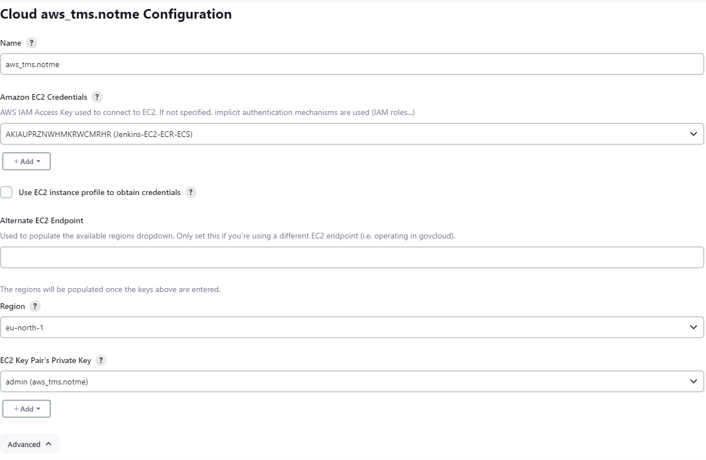

## 1

Создать вручную или через Packer образ VM с установленным Docker.

```
Создал template в aws со следующим startup скриптом:
1. устанавливается docker и java
2. создаётся пользователь jenkins
3. добавляется в группу docker
4. скачивается с машины jenkins jnlp агент и устанавливается на данной машине
5. через ключ -jnlpUrl геристрируется нода EC2_slave_node
6. создаётся сервис по запуску jnlp агента и доавляется в автозагрузку
```


## 2

Настроить интеграцию Jenkins с GCP для создания агентов из этого образа.

```
Также, через плагин для jenkins создал подключение к aws и при подключении, чтобы создавался instance с аналогичным скриптом
```



## 3

Найти любое веб-приложение, которое мы вы хотели бы развернуть в облаке.

```
https://github.com/Textualize/textual-web
```


## 4

Реализовать pipeline, который:
- собирает Docker образ для приложения.
- публикует собранный образа в Google Container Registry.
- развертывает приложение в App Engine Flexible Environment из собранного образа с помощью gcloud app deploy --image-url=[HOSTNAME]/[PROJECT-ID]/[IMAGE].


[Jenkinsfile](Jenkinsfile) [Jenkins_Output](Jenkins_Output)


```
Pipline собирает образ делает pull в ECR.
Разворачивает этот образ в Fargate:
1. создаёт кластер в ECS
2. создаётся TaskDefinition с ранее созданным контейнером из ECR
3. вычисляется версия этого TaskDefinition
4. создаётся task для запуска ранее созданного TaskDefinition последней версии и запускается в Fargate
```
