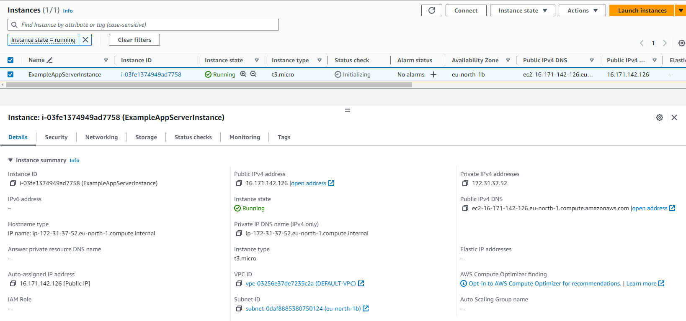

## 1

Установить Terraform.

```
terraform.exe -v
Terraform v1.6.6
on windows_amd64
```


## 2

Написать шаблон для создания виртуальной машины в облаке

```
terraform {
  required_providers {
    aws = {
      source  = "hashicorp/aws"
      version = "~> 4.16"
    }
  }

  required_version = ">= 1.2.0"
}

provider "aws" {
  region  = "eu-north-1"
}

resource "aws_instance" "app_server" {
  ami           = "ami-067f3514568fd5760"
  instance_type = "t3.micro"

  tags = {
    Name = "ExampleAppServerInstance"
  }
}
```


## 3

 Познакомиться с командами:
- terraform init
- terraform fmt
- terraform validate
- terraform plan
- terraform apply
- terraform destroy

```

```


## 4

Создать виртуальную машину в облаке при помощи ранее созданного шаблона.

```
terraform.exe apply

Terraform used the selected providers to generate the following execution plan. Resource actions are indicated with the following symbols:
  + create

Terraform will perform the following actions:

  # aws_instance.app_server will be created
  + resource "aws_instance" "app_server" {
      + ami                                  = "ami-067f3514568fd5760"
      + arn                                  = (known after apply)
      + associate_public_ip_address          = (known after apply)
      + availability_zone                    = (known after apply)
      + cpu_core_count                       = (known after apply)
      + cpu_threads_per_core                 = (known after apply)
      + disable_api_stop                     = (known after apply)
      + disable_api_termination              = (known after apply)
      + ebs_optimized                        = (known after apply)
      + get_password_data                    = false
      + host_id                              = (known after apply)
      + host_resource_group_arn              = (known after apply)
      + iam_instance_profile                 = (known after apply)
      + id                                   = (known after apply)
      + instance_initiated_shutdown_behavior = (known after apply)
      + instance_state                       = (known after apply)
      + instance_type                        = "t3.micro"
      + ipv6_address_count                   = (known after apply)
      + ipv6_addresses                       = (known after apply)
      + key_name                             = (known after apply)
      + monitoring                           = (known after apply)
      + outpost_arn                          = (known after apply)
      + password_data                        = (known after apply)
      + placement_group                      = (known after apply)
      + placement_partition_number           = (known after apply)
      + primary_network_interface_id         = (known after apply)
      + private_dns                          = (known after apply)
      + private_ip                           = (known after apply)
      + public_dns                           = (known after apply)
      + public_ip                            = (known after apply)
      + secondary_private_ips                = (known after apply)
      + security_groups                      = (known after apply)
      + source_dest_check                    = true
      + subnet_id                            = (known after apply)
      + tags                                 = {
          + "Name" = "ExampleAppServerInstance"
        }
      + tags_all                             = {
          + "Name" = "ExampleAppServerInstance"
        }
      + tenancy                              = (known after apply)
      + user_data                            = (known after apply)
      + user_data_base64                     = (known after apply)
      + user_data_replace_on_change          = false
      + vpc_security_group_ids               = (known after apply)
    }

Plan: 1 to add, 0 to change, 0 to destroy.

Do you want to perform these actions?
  Terraform will perform the actions described above.
  Only 'yes' will be accepted to approve.

  Enter a value: yes

aws_instance.app_server: Creating...
aws_instance.app_server: Still creating... [10s elapsed]
aws_instance.app_server: Creation complete after 13s [id=i-03fe1374949ad7758]

Apply complete! Resources: 1 added, 0 changed, 0 destroyed.
```



## 5

Поменять тип виртуальной машины (увеличить количество ресурсов) через веб консоль и выполнить terraform plan. Что предлагает сделать Terraform?

```
terraform.exe plan 
aws_instance.app_server: Refreshing state... [id=i-03fe1374949ad7758]

Terraform used the selected providers to generate the following execution plan. Resource actions are indicated with the following symbols:
  ~ update in-place

Terraform will perform the following actions:

  # aws_instance.app_server will be updated in-place
  ~ resource "aws_instance" "app_server" {
        id                                   = "i-03fe1374949ad7758"
      ~ instance_type                        = "t3.nano" -> "t3.micro"
        tags                                 = {
            "Name" = "ExampleAppServerInstance"
        }
        # (28 unchanged attributes hidden)

        # (9 unchanged blocks hidden)
    }

Plan: 0 to add, 1 to change, 0 to destroy.
```
