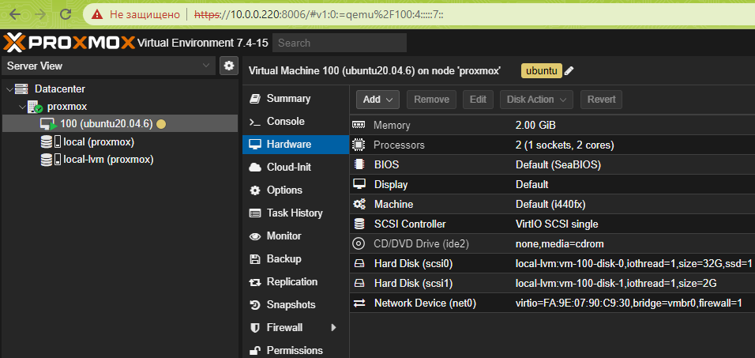
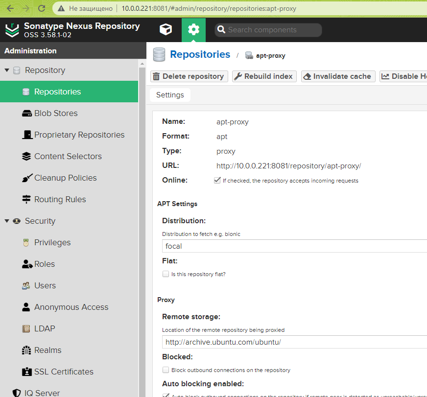
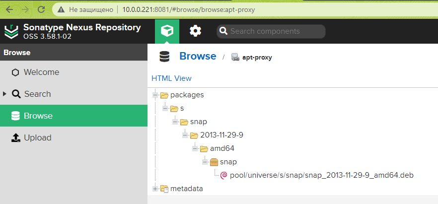
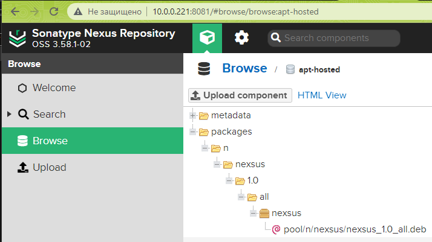

## 1

Добавить новый диск к виртуальной машине и проверить, что система видит его.

```
$ lsblk
NAME                      MAJ:MIN RM  SIZE RO TYPE MOUNTPOINT
loop0                       7:0    0 63.5M  1 loop /snap/core20/1950
loop1                       7:1    0 91.9M  1 loop /snap/lxd/24061
loop3                       7:3    0 53.3M  1 loop /snap/snapd/19457
loop4                       7:4    0 49.9M  1 loop /snap/snapd/18357
loop5                       7:5    0 63.5M  1 loop /snap/core20/1974
sda                         8:0    0   32G  0 disk
├─sda1                      8:1    0    1M  0 part
├─sda2                      8:2    0    2G  0 part /boot
└─sda3                      8:3    0   30G  0 part
  └─ubuntu--vg-ubuntu--lv 253:0    0   15G  0 lvm  /
sdb                         8:16   0    2G  0 disk
└─sdb1                      8:17   0    2G  0 part
sr0                        11:0    1 1024M  0 rom
```



## 2

Вывести в консоль информацию по текущему размеру файловой системы.

```
$ df -h
Filesystem                         Size  Used Avail Use% Mounted on
udev                               941M     0  941M   0% /dev
tmpfs                              198M  1.2M  196M   1% /run
/dev/mapper/ubuntu--vg-ubuntu--lv   15G  5.2G  8.8G  37% /
tmpfs                              986M     0  986M   0% /dev/shm
tmpfs                              5.0M     0  5.0M   0% /run/lock
tmpfs                              986M     0  986M   0% /sys/fs/cgroup
/dev/loop0                          64M   64M     0 100% /snap/core20/1950
/dev/loop1                          92M   92M     0 100% /snap/lxd/24061
/dev/sda2                          2.0G  209M  1.6G  12% /boot
/dev/loop3                          54M   54M     0 100% /snap/snapd/19457
/dev/loop4                          50M   50M     0 100% /snap/snapd/18357
/dev/loop5                          64M   64M     0 100% /snap/core20/1974
tmpfs                              198M     0  198M   0% /run/user/1000
```


## 3

Расширить корневую файловую систему за счёт добавленного диска.

```
$ lsblk
NAME                      MAJ:MIN RM  SIZE RO TYPE MOUNTPOINT
loop0                       7:0    0 63.5M  1 loop /snap/core20/1950
loop1                       7:1    0 49.9M  1 loop /snap/snapd/18357
loop2                       7:2    0 53.3M  1 loop /snap/snapd/19457
loop3                       7:3    0 63.5M  1 loop /snap/core20/1974
loop4                       7:4    0 91.9M  1 loop /snap/lxd/24061
sda                         8:0    0   32G  0 disk
├─sda1                      8:1    0    1M  0 part
├─sda2                      8:2    0    2G  0 part /boot
└─sda3                      8:3    0   30G  0 part
  └─ubuntu--vg-ubuntu--lv 253:0    0   15G  0 lvm  /
sdb                         8:16   0    2G  0 disk
└─sdb1                      8:17   0    2G  0 part
sr0                        11:0    1 1024M  0 rom

$ sudo fdisk /dev/sdb
Command (m for help): d
Selected partition 1
Partition 1 has been deleted.

Command (m for help): n
Partition type
   p   primary (0 primary, 0 extended, 4 free)
   e   extended (container for logical partitions)

Select (default p): p
Partition number (1-4, default 1): 1
First sector (2048-4194303, default 2048):
Last sector, +/-sectors or +/-size{K,M,G,T,P} (2048-4194303, default 4194303):

Created a new partition 1 of type 'Linux' and of size 2 GiB.

Command (m for help): t
Selected partition 1

Hex code (type L to list all codes): 8e
Changed type of partition 'Linux' to 'Linux LVM'.

Command (m for help): p
Disk /dev/sdb: 2 GiB, 2147483648 bytes, 4194304 sectors
Disk model: QEMU HARDDISK
Units: sectors of 1 * 512 = 512 bytes
Sector size (logical/physical): 512 bytes / 512 bytes
I/O size (minimum/optimal): 512 bytes / 512 bytes
Disklabel type: dos
Disk identifier: 0xe13ed367

Device     Boot Start     End Sectors Size Id Type
/dev/sdb1        2048 4194303 4192256   2G 8e Linux LVM

Command (m for help): w
The partition table has been altered.
Calling ioctl() to re-read partition table.
Syncing disks.

$ sudo pvcreate /dev/sdb1
WARNING: dos signature detected on /dev/sdb1 at offset 510. Wipe it? [y/n]: y
  Wiping dos signature on /dev/sdb1.
  Physical volume "/dev/sdb1" successfully created.


$ sudo pvs
  PV         VG        Fmt  Attr PSize   PFree
  /dev/sda3  ubuntu-vg lvm2 a--  <30.00g 15.00g
  /dev/sdb1            lvm2 ---   <2.00g <2.00g

$ sudo vgs
  VG        #PV #LV #SN Attr   VSize   VFree
  ubuntu-vg   1   1   0 wz--n- <30.00g 15.00g

$ sudo vgextend ubuntu-vg /dev/sdb1
  Volume group "ubuntu-vg" successfully extended

$ sudo vgs
  VG        #PV #LV #SN Attr   VSize  VFree
  ubuntu-vg   2   1   0 wz--n- 31.99g <17.00g

$ sudo lvextend -l +512 /dev/ubuntu-vg/ubuntu-lv
  Size of logical volume ubuntu-vg/ubuntu-lv changed from <15.00 GiB (3839 extents) to <17.00 GiB (4351 extents).
  Logical volume ubuntu-vg/ubuntu-lv successfully resized.

$ sudo vgdisplay
  --- Volume group ---
  VG Name               ubuntu-vg
  System ID
  Format                lvm2
  Metadata Areas        2
  Metadata Sequence No  4
  VG Access             read/write
  VG Status             resizable
  MAX LV                0
  Cur LV                1
  Open LV               1
  Max PV                0
  Cur PV                2
  Act PV                2
  VG Size               31.99 GiB
  PE Size               4.00 MiB
  Total PE              8190
  Alloc PE / Size       4351 / <17.00 GiB
  Free  PE / Size       3839 / <15.00 GiB
  VG UUID               XRAPqF-G610-sI4R-tnhJ-QMJ1-VK0T-gPnjmQ

$ sudo resize2fs /dev/ubuntu-vg/ubuntu-lv
resize2fs 1.45.5 (07-Jan-2020)
Filesystem at /dev/ubuntu-vg/ubuntu-lv is mounted on /; on-line resizing required
old_desc_blocks = 2, new_desc_blocks = 3
The filesystem on /dev/ubuntu-vg/ubuntu-lv is now 4455424 (4k) blocks long.
```


## 4

Вывести информацию по новому размеру файловой системы.

```
$ df -h
Filesystem                         Size  Used Avail Use% Mounted on
udev                               941M     0  941M   0% /dev
tmpfs                              198M  988K  197M   1% /run
/dev/mapper/ubuntu--vg-ubuntu--lv   17G  5.2G   11G  33% /
tmpfs                              986M     0  986M   0% /dev/shm
tmpfs                              5.0M     0  5.0M   0% /run/lock
tmpfs                              986M     0  986M   0% /sys/fs/cgroup
/dev/loop0                          64M   64M     0 100% /snap/core20/1950
/dev/loop2                          54M   54M     0 100% /snap/snapd/19457
/dev/loop1                          50M   50M     0 100% /snap/snapd/18357
/dev/sda2                          2.0G  209M  1.6G  12% /boot
/dev/loop3                          64M   64M     0 100% /snap/core20/1974
/dev/loop4                          92M   92M     0 100% /snap/lxd/24061
```


## 5

Вывести в консоль текущую рабочую директорию.

```
$ pwd
/home/notme
```


## 6

Вывести в консоль все файлы из домашней директории.

```
$ ls -Al | grep '^-'
-rw------- 1 notme notme 47936 Aug  9 11:56 .bash_history
-rw-r--r-- 1 notme notme   220 Feb 25  2020 .bash_logout
-rw-r--r-- 1 notme notme  3771 Feb 25  2020 .bashrc
-rwxrwxr-x 1 notme notme  1694 Jul 19 00:30 create-issues.sh
-rw-rw-r-- 1 notme notme   280 Jul 18 22:08 days.txt
-rwxrwxr-x 1 notme notme    88 Jul 18 22:07 herestrings.sh
-rw-r--r-- 1 notme notme   807 Feb 25  2020 .profile
-rw-rw-r-- 1 notme notme    66 Jul 13 18:11 .selected_editor
-rwxrwxr-x 1 notme notme   115 Jul 31 19:40 some.sh
-rw-r--r-- 1 notme notme     0 Jun 25 21:08 .sudo_as_admin_successful
-rw-rw-r-- 1 notme notme   165 Jul 13 18:57 .wget-hsts
-rw------- 1 notme notme    58 Jun 25 21:10 .Xauthority
-rw-rw-r-- 1 notme notme 25625 Jul 21 15:36 ya.ru
```


## 7

Построить маршрут до google.com при помощи утилиты traceroute.

```
$ traceroute google.com
traceroute to google.com (172.217.16.14), 30 hops max, 60 byte packets
 1  control (10.0.0.1)  0.851 ms  0.918 ms  1.059 ms
 2  192.168.1.1 (192.168.1.1)  3.257 ms  3.279 ms  3.298 ms
 3  pppoe-static.86.57.226.254.telecom.mogilev.by (86.57.226.254)  6.474 ms  6.487 ms  6.597 ms
 4  93.84.80.165 (93.84.80.165)  8.940 ms  9.306 ms 93.84.80.161 (93.84.80.161)  6.803 ms
 5  core2.net.belpak.by (93.85.253.205)  14.730 ms core1.net.belpak.by (93.85.253.193)  17.802 ms core2.net.belpak.by (93.85.253.205)  14.928 ms
 6  ie1.net.belpak.by (93.85.80.38)  20.354 ms ie1.net.belpak.by (93.85.80.50)  15.319 ms  15.247 ms
 7  asbr9.net.belpak.by (93.85.80.238)  14.854 ms  19.179 ms  19.648 ms
 8  74.125.146.96 (74.125.146.96)  16.015 ms  24.523 ms  16.235 ms
 9  108.170.250.193 (108.170.250.193)  22.278 ms 108.170.250.209 (108.170.250.209)  23.485 ms  23.474 ms
10  216.239.40.213 (216.239.40.213)  23.140 ms 216.239.40.43 (216.239.40.43)  22.163 ms  22.141 ms
11  mil02s06-in-f14.1e100.net (172.217.16.14)  19.507 ms  19.471 ms  16.742 ms
```


## 8

Установить Sonatype Nexus OSS по следующей инструкции, а именно:
- установку произвести в директорию /opt/nexus.
- запустить приложение от отдельного пользователя nexus.
- реализовать systemd оболочку для запуска приложения как сервис.

```
$ sudo apt-get install openjdk-8-jre

$ java -version
openjdk version "1.8.0_382"
OpenJDK Runtime Environment (build 1.8.0_382-8u382-ga-1~20.04.1-b05)
OpenJDK 64-Bit Server VM (build 25.382-b05, mixed mode)


$ wget https://download.sonatype.com/nexus/3/nexus-3.58.1-02-unix.tar.gz

$ sudo tar -xvzf nexus-3.58.1-02-unix.tar.gz -C /opt/nexus/

$ sudo adduser nexus
Adding user `nexus' ...
Adding new group `nexus' (1005) ...
Adding new user `nexus' (1002) with group `nexus' ...
Creating home directory `/home/nexus' ...
Copying files from `/etc/skel' ...
New password:
Retype new password:
passwd: password updated successfully
Changing the user information for nexus
Enter the new value, or press ENTER for the default
        Full Name []:
        Room Number []:
        Work Phone []:
        Home Phone []:
        Other []:
Is the information correct? [Y/n] y

$ sudo chown -R nexus:nexus /opt/nexus/

$ sudo chown -R nexus:nexus /opt/nexus/sonatype-work/

$ cat /opt/nexus/bin/nexus.rc
run_as_user="nexus"

$ cat /etc/systemd/system/nexus.service
[Unit]
Description=nexus service
After=network.target

[Service]
Type=forking
LimitNOFILE=65536
User=nexus
Group=nexus
ExecStart=/opt/nexus/bin/nexus start
ExecStop=/opt/nexus/bin/nexus stop
User=nexus
Restart=on-abort

[Install]
WantedBy=multi-user.target

$ cat bin/nexus | grep INSTALL4J_JAVA_HOME_OVERRIDE=
INSTALL4J_JAVA_HOME_OVERRIDE=/usr/lib/jvm/java-8-openjdk-amd64/


$ sudo systemctl start nexus

$ sudo systemctl status nexus
● nexus.service - nexus service
     Loaded: loaded (/etc/systemd/system/nexus.service; disabled; vendor preset: enabled)
     Active: active (running) since Wed 2023-08-09 13:54:50 +03; 3min 41s ago
    Process: 11271 ExecStart=/opt/nexus/bin/nexus start (code=exited, status=0/SUCCESS)
   Main PID: 11456 (java)
      Tasks: 67 (limit: 2257)
     Memory: 1.6G
     CGroup: /system.slice/nexus.service
             └─11456 /usr/lib/jvm/java-8-openjdk-amd64//bin/java -server -Dinstall4j.jvmDir=/usr/lib/jvm/java-8-openjdk-amd64/ -Dexe4j.moduleName=/opt/nexus/bin/nexus -XX:+UnlockDiagnosticVMOptions -Dinsta>

Aug 09 13:54:50 ubuntu-study systemd[1]: Starting nexus service...
Aug 09 13:54:50 ubuntu-study nexus[11271]: Starting nexus
Aug 09 13:54:50 ubuntu-study systemd[1]: Started nexus service.
```


## 9

Создать в Nexus proxy репозиторий для пакетов ОС и разрешить анонимный доступ.





## 10

Поменять для текущей VM основной репозиторий пакетов на созданный ранее proxy в Nexus.

```
$ cat  /etc/apt/sources.list | grep 8081
deb http://10.0.0.221:8081/repository/apt-proxy/ focal main restricted
deb http://10.0.0.221:8081/repository/apt-proxy/ focal-updates main restricted
deb http://10.0.0.221:8081/repository/apt-proxy/ focal universe
deb http://10.0.0.221:8081/repository/apt-proxy/ focal-updates universe
deb http://10.0.0.221:8081/repository/apt-proxy/ focal multiverse
deb http://10.0.0.221:8081/repository/apt-proxy/ focal-updates multiverse
deb http://10.0.0.221:8081/repository/apt-proxy/ focal-backports main restricted universe multiverse
deb http://10.0.0.221:8081/repository/apt-proxy/ focal-security main restricted
deb http://10.0.0.221:8081/repository/apt-proxy/ focal-security universe
deb http://10.0.0.221:8081/repository/apt-proxy/ focal-security multiverse

$ sudo apt update
```


## 11

Выполнить установку пакета snap и убедиться, что на proxy репозитории в Nexus появились пакеты.

```
$ sudo apt install snap
Reading package lists... Done
Building dependency tree
Reading state information... Done
The following NEW packages will be installed:
  snap
0 upgraded, 1 newly installed, 0 to remove and 10 not upgraded.
Need to get 376 kB of archives.
After this operation, 2,714 kB of additional disk space will be used.
Get:1 http://10.0.0.221:8081/repository/apt-proxy focal/universe amd64 snap amd64 2013-11-29-9 [376 kB]
Fetched 376 kB in 1s (318 kB/s)
Selecting previously unselected package snap.
(Reading database ... 124766 files and directories currently installed.)
Preparing to unpack .../snap_2013-11-29-9_amd64.deb ...
Unpacking snap (2013-11-29-9) ...
Setting up snap (2013-11-29-9) ...
Processing triggers for man-db (2.9.1-1) ...
```



## 12

На основании шагов из предыдущих пунктов создать DEB/RPM пакет для установки Nexus и загрузить его в Nexus.

```
$ gpg --gen-key

gpg (GnuPG) 2.2.19; Copyright (C) 2019 Free Software Foundation, Inc.
This is free software: you are free to change and redistribute it.
There is NO WARRANTY, to the extent permitted by law.

Note: Use "gpg --full-generate-key" for a full featured key generation dialog.

GnuPG needs to construct a user ID to identify your key.

Real name: notme
Email address:
You selected this USER-ID:
    "notme"

Change (N)ame, (E)mail, or (O)kay/(Q)uit? O
.....
gpg: /home/notme/.gnupg/trustdb.gpg: trustdb created
gpg: key 185EB52C35ED88E3 marked as ultimately trusted
gpg: directory '/home/notme/.gnupg/openpgp-revocs.d' created
gpg: revocation certificate stored as '/home/notme/.gnupg/openpgp-revocs.d/DD244A0205A1FFD0BFF93450185EB52C35ED88E3.rev'
public and secret key created and signed.

pub   rsa3072 2023-08-09 [SC] [expires: 2025-08-08]
      DD244A0205A1FFD0BFF93450185EB52C35ED88E3
uid                      notme
sub   rsa3072 2023-08-09 [E] [expires: 2025-08-08]

$ gpg --armor --output public.gpg.key --export DD244A0205A1FFD0BFF93450185EB52C35ED88E3
$ gpg --armor --output private.gpg.key --export-secret-key DD244A0205A1FFD0BFF93450185EB52C35ED88E3
$ ls
nexus  private.gpg.key  public.gpg.key

содержимое $ cat private.gpg.key вставляем в поле для ключа в момент создания repo (hosted)


$ fakeroot dpkg-deb --build nexus

```
